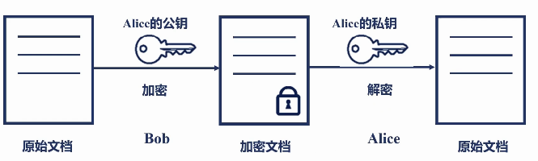

[TOC]

# 1 综述

由于Nginx与硬件和操作系统的深度挖掘，使得其在保持高并发的前提下实现了高吞吐量。其优秀的模块设计使得其生态圈异常丰富。大量的第三方模块使得Nginx轻松实现大量场景下的定制化需求。BSD许可证又赋予Nginx最大的灵活性。

### 1.1 Nginx优点

 - 高并发，高性能
 - 可扩展性好
 - 高可靠性
 - 热部署
 - BSD许可

### 1.2 课程模块

 - 初识Nginx
 - Nginx架构基础
 - 详解HTTP模块
 - 反向代理与负载均衡
 - Nginx的系统层性能优化
 - 从源码视角深入使用Nginx与Openresty

初识Nginx：快速了解Nginx，熟悉其基本使用

Nginx架构基础：进程模型，数据结果

详解HTTP模块：Nginx是如何处理请求的，依照处理流程来讲解常用HTTP模块中的指令、变量的用法

反向代理与负载均衡：以7层负载均衡为主，兼顾4层负载均衡，实现不同上游协议的反向代理，理解如何配置才能处理上下游流量的高效交互

Nginx的系统层性能优化：有效调节Linux系统下的CPU、内存、网络、磁盘等配置与Nginx config文件中的指令如何配合。使Nginx性能最大化

从源码视角深入使用Nginx与Openresty：从Nginx的实现层面打通前5个方面的知识，从而理解Nginx的机制与能力模型，并介绍openresty与Nginx如何有效搭配使用

# 2 初识Nginx

## 2.1 使用场景

最重用的三个使用场景：

 - 静态资源服务：通过本地文件系统提供服务
 - 反向代理服务：Nginx的强大性能；缓存；负载均衡
 - API服务：OpenResty

Nginx的三个主要应用场景


### 2.1.1 第一个应用场景

**反向代理**

- 负载均衡
- 缓存加速

上图中，一个请求过来后先到Nginx, 然后到应用服务，如Django, Tomcat等。然后再去访问redis或MySQL数据库，提供基本的数据功能。但这里有个问题：我们的应用服务因为要求开发效率非常的高，所以它的运行效率是很低的。它的QPS TPS 或并发都是受限的，所以我们需要把很多这样的应用服务组成一个集群，向用户提供高可用性。而一旦很多服务构成集群的时候，我们需要Nginx具有反向代理功能，可以把动态请求传到给应用服务。而很多应用服务构成集群，它一定会带来两个需求：第一，动态扩容；第二，有些服务出问题的时候我们需要做容灾，这样我们的反向代理必须具备负载均衡功能。

像这样的一个链路中，Nginx处于企业内网的边缘节点，随着网络链路的增长，用户体验到的时延会增加，所以可以把用户看起来不变的，或一段时间内看起来不变的动态内容缓存在Nginx部分，由Nginx直接像用户提供访问。这样时延就会减小很多。这样反向代理就衍生出另外一个功能叫缓存，它能加速我们的访问。

### 2.1.2 第二个应用场景

**静态资源**

而很多时候我们访问的css js html 图片这些静态资源是没必要由应用服务来访问的,它只需要通过本地文件，系统上放置的静态资源，直接由Nginx提供访问即可。这是Nginx的静态资源功能。

### 2.1.3 第三个应用场景

**API服务**

因为应用服务本身的性能有很多的问题，但数据库服务要比应用服务好的多，因为它的业务场景比较简单，它的并发性能和TPS都远高于应用服务，所以衍生出第三个应用场景，由Nginx直接去访问数据库或redis或应用服务，利用Nginx强大的并发性能，实现如web防火墙，这样复杂的业务功能来提供给用户。这样这要求我们的API服务有非常强大的业务处理功能，如openresty, Nginx集成javascript， 利用javascript或lua语言先天自带的工具库来提供完整的API服务。

## 2.2 Nginx出现的历史背景

Nginx为什么会出现？

主要原因：

1. 互联网的数据量快速增长

   互联网的快速普及

   全球化

   物联网

2. 摩尔定律：性能提升

   CPU频率的提高受限，开始想多核方向发展，但很多软件并没有为多核架构做好准备。

3. 低效的Apache

   一个连接对应一个进程，使用了进程间切换，进程间切换代价很高。

## 2.3 Nginx的使用优点

1. 高并发，高性能
2. 可扩展性好
3. 高可靠
4. 热部署，不重启进行升级
5. BSD许可证

## 2.4 Nginx的四个主要组成部分

### 2.4.1 Nginx二进制可执行文件

由各模块源码编译出的一个文件

由Nginx本身的框架、官方模块、编译进去的各种第三方模块一起构建的文件。相当于汽车本身

### 2.4.2 配置文件

nginx.conf-控制Nginx行为，相当于驾驶员

### 2.4.3 访问日志

access.log记录每一条http请求信息，tps轨迹-运营

### 2.4.4 错误日志

定位问题

## 2.5 Nginx的版本发布历史

版本发布情况：

mainline：单号，新增很多功能，但可能不稳定

stable：双号，稳定版

**版本选择**

开源：Nginx --- nginx.org

商业：Nginx Plus --- nginx.org

阿里巴巴Tengine:

Tengine是由淘宝网发起的Web服务器项目。它在Nginx的基础上，针对大访问量网站的需求，添加了很多高级功能和特性。Tengine的性能和稳定性已经早大型的网站如淘宝网，天猫商城等得到了很好的检验。Tengine很多特性领先于Nginx官方版本，其修改了Nginx官方版本的主干代码，这样就遇到一个问题，就是没办法跟Nginx的官方版本同步升级。所以虽然其生态也很丰富，也可以使用官方的第三方模块，但由于这个特点，不推荐使用。

Openresty

开源版与商业版

开源Openresty: http://openresty.org

商业版openrestry: https://openresty.com

**如果业务功能没太强的诉求，那开源的Nginx即可满足。如果开发API服务或web防火墙，则Openresty是个很好的选择**

## 2.6 编译Nginx

Nginx的官方模块不是每个都是默认开启的，需要编译开启。这样才能将第三方模块编译进Nginx的二进制文件中。

### 2.6.1 源码目录介绍

下载nginx源码文件并解压:

```bash
# wget https://nginx.org/download/nginx-1.14.2.tar.gz
# wget https://nginx.org/download/nginx-1.14.2.tar.gz
# wget https://nginx.org/download/nginx-1.14.2.tar.gz
[root@development nginx-1.14.2]# ll
total 736
drwxr-xr-x 6 nginx nginx   4096 Oct 31 13:29 auto
-rw-r--r-- 1 nginx nginx 288742 Dec  4  2018 CHANGES
-rw-r--r-- 1 nginx nginx 440121 Dec  4  2018 CHANGES.ru
drwxr-xr-x 2 nginx nginx   4096 Oct 31 13:29 conf
-rwxr-xr-x 1 nginx nginx   2502 Dec  4  2018 configure
drwxr-xr-x 4 nginx nginx     68 Oct 31 13:29 contrib
drwxr-xr-x 2 nginx nginx     38 Oct 31 13:29 html
-rw-r--r-- 1 nginx nginx   1397 Dec  4  2018 LICENSE
drwxr-xr-x 2 nginx nginx     20 Oct 31 13:29 man
-rw-r--r-- 1 nginx nginx     49 Dec  4  2018 README
drwxr-xr-x 9 nginx nginx     84 Oct 31 13:29 src
```

auto目录: 4个子目录, cc directory-- used for complie

​					lib directory-- library

​					os directory - detect os type

​				其他的文件是辅助configure脚本执行的时候去判定支持哪些模块，当前操作系统有什么特性可以供给Nginx使用

change文件：Nginx每个版本提供了哪些特性和Bug fix

conf目录：配置文件示例目录，里面包含配置文件模板，安装后拷贝到Nginx的配置文件目录

configure文件：脚本，用来生成中间文件，zhixi编译前的必备动作

contrib目录：提供了2个perl脚本和vim的工具，提供配置文件语法高亮等支持。使用方法：

```bash
[root@development nginx-1.14.2]# cp -r contrib/vim/* ~/.vim/
```

html目录：提供了两个标准的 html文件，50x错误和Index.html欢迎页面 

man目录：Linux对Nginx的帮助文件,查看帮助文件内容

```bash
[root@development man]# ls
nginx.8
[root@development man]# man ./nginx.8 
```

src目录：源代码，框架都这个目录中

### 2.6.2 Configuration

编译前先看看configure支持哪些参数：

```bash
[root@development nginx-1.14.2]# ./configure --help | more
```

这里分为几个大块：

1 PATH相关，编译时去哪里找一些文件作为其辅助文件

如动态模块--modules-path=PATH

nginx.lock文件的位置：--lock-path=PATH

如果没有变动，则只需要指定--prefix=PATH,其他的配置则在prefix指定的目录中建立响应的文件夹

2 第二类参数主要是确定使用哪些模块，不使用哪些模块。参数的前缀通常是with 或without. 带with的，意味着默认是不会编译进nginx的；带without的默认是便已进Nginx的。

3 第三类参数指定了Nginx编译过程中需要的特殊参数。如gcc编译需要设定的优化参数，开启debug级别日志等

configure：

```bash
[root@development nginx-1.14.2]# ./configure --prefix=/root/nginx # /root/nginx目录此时可以不存在 
```

configure之后会生成一些中间文件，放到objs目录

### 2.6.3 生成中间文件介绍

```bash
[root@development objs]# pwd
/root/nginx-1.14.2/objs
[root@development objs]# ll
total 80
-rw-r--r-- 1 root root 17628 Nov  4 12:46 autoconf.err
-rw-r--r-- 1 root root 39263 Nov  4 12:46 Makefile
-rw-r--r-- 1 root root  6793 Nov  4 12:46 ngx_auto_config.h
-rw-r--r-- 1 root root   657 Nov  4 12:46 ngx_auto_headers.h
-rw-r--r-- 1 root root  5725 Nov  4 12:46 ngx_modules.c
drwxr-xr-x 9 root root    84 Nov  4 12:46 src
```

这里比较重要的是ngx_modules.c文件，它决定了接下来编译的时候有哪些模块会被编译进Nginx。

所有的模块都列在这个文件中

### 2.6.3 执行编译

```bash
[root@development nginx-1.14.2]# pwd
/root/nginx-1.14.2
[root@development nginx-1.14.2]# make
```

make没有错误的话，编译后的nginx二进制文件放在objs目录中。这里需要知道编译后二进制文件的位置，因为在升级的过程中，make之后并不是执行make install进行安装升级，而是将make之后生成的二进制文件拷贝到安装目录中

编译时生的中间文件都放在objs/src文件中

安装:

```bash
[root@development nginx-1.14.2]# make install
[root@development nginx-1.14.2]# ll /root/nginx
total 4
drwxr-xr-x 2 root root 4096 Nov  4 13:02 conf
drwxr-xr-x 2 root root   38 Nov  4 13:02 html
drwxr-xr-x 2 root root    6 Nov  4 13:02 logs
drwxr-xr-x 2 root root   18 Nov  4 13:02 sbin
```

## 2.7 Nginx配置语法

Nginx配置文件是一个ascii文本文件，主要由两部分组成：一部分是directive指令；一部分是directive block指令块。

1. 配置文件由指令和指令块构成
2. 每条指令以; 分号结尾，指令与参数间以空格分隔
3. 指令块以{}大括号将多条指令组织在一起
4. include语句允许组合多个配置文件以提升可维护性
5. 使用#符号添加注释，提高可读性
6. 使用$符号使用变量
7. 部分执行的参数支持正则表达式

```nginx
http {
    include		mime.types;
    upstream thwp {
        server 127.0.0.1:8000;
    }
    
    server {
        listen 443 http2;
        #Nginx配置语法
        limit req zone $binary_remote_addr zone=one:10m rate=1r/s;
        location ~* \.(gif|jpg|jpeg)$ {
            proxy_cache my_cache;
            expires 3m;proxy_cache_key $host$uri$is_args$args;
            proxy_pass http://thwp;
        }
    }
}
```

**配置参数：时间的单位**

ms		milliseconds

s		seconds

m		minutes

h		hours

d 		days

w		weeks

M		months, 30 days

y		years, 365 days

**配置参数: 空间的单位**

当数字后不加任何空间单位时，表示bytes

 		bytes

k/K		kilobytes

m/M	megabytes

g/G		gigabytes

**http配置的指令块**

包含4个块：

- http
- upstream
- server
- location

## 2.8 Nginx命令行及演示:重载、热部署、日志切割

**Nginx命令行**

格式：nginx -s reload

帮助：-?  -h

使用指定的配置文件：-c

指定配置指令：-g ，命令行中指定指令，覆盖配置文件中的指令

指定运行目录：-p

发送信号：-s

 - 立刻停止服务：stop
 - 优雅的停止服务：quit
 - 重载配置文件：reload
 - 重新开始记录日志文件：reopen

测试配置文件是否有语法错误：-t  -T

打印Nginx的版本信息、编译信息等：-v  -V

### 2.8.1 命令行演示

**重载配置文件**

编辑nginx.conf文件后执行：`nginx -s reload` (最好先检查一下语法)

**热部署**

当Nginx处于运行状态时

```bash
[root@development sbin]# ps -ef | grep nginx
root      1149     1  0 13:06 ?        00:00:00 nginx: master process ./nginx
nobody    1156  1149  0 13:06 ?        00:00:00 nginx: worker process
```

现在想更换最新版本的Nginx，根据之前的编译方法，编译了一个更新版本的Nginx。

首先需要把现有的Nginx二进制文件备份

```bash
[root@development sbin]# cp nginx nginx.old
```

然后，把刚编译好的二进制文件拷贝到目录中，替换正在运行的Nginx进程所使用的二进制文件

```bash
[root@development objs]# cp -r nginx /usr/local/openresty/nginx/sbin -f
```

给正则运行的Nginx的Master进程发送信号，告知即将进行热部署

```bash
[root@development sbin]# kill -USR2 1149 (1149是nginx master进程的pid)
```

这样Nginx会使用新的Nginx二进制文件新起master进程和新的work进程，此时老的master 与work进程也存在，但不在监听80 或443。

```bash
[root@development sbin]# ps -ef | grep nginx
root      1149     1  0 13:06 ?        00:00:00 nginx: master process ./nginx
nobody    1156  1149  0 13:06 ?        00:00:00 nginx: worker process
root      1166  1149  0 13:16 ?        00:00:00 nginx: master process ./nginx
nobody    1167  1166  0 13:16 ?        00:00:00 nginx: worker process
```


给老的master进程发送信号，告知其优雅关闭它的work进程

```bash
[root@development sbin]# kill -WINCH 1149
```

可以看到老的work进程已经退出,说明请求都到了新的work进程中。

但老的Master进程还在，为了防止热部署后发现还有问题，需要将新版本退出到老版本，可以给老的master进程发送reload命令，让其重新拉起work进程，再把新版本关闭。老的master进程不会自动退出的，留在这里允许我们做版本回退。

```bash
[root@development sbin]# ps -ef | grep nginx
root      1149     1  0 13:06 ?        00:00:00 nginx: master process ./nginx
root      1166  1149  0 13:16 ?        00:00:00 nginx: master process ./nginx
nobody    1167  1166  0 13:16 ?        00:00:00 nginx: worker process
```

**切割日志文件**

```bash
[root@development logs]# mv access.log log.bak
[root@development logs]# ../sbin/nginx -s reopen
```

一般可以采用脚本结合crontab来做

```bash
[root@development logs]# crontab -l
0 0 1 * * root /usr/local/openresty/nginx/logs/rotate.sh
[root@development logs]# pwd
/root/nginx/logs
[root@development logs]# cat rotate.sh 
#!/bin/bash
# Rotate the Nginx logs to prevent a single logfile from consuming too much disk space.
LOGS_PATH=/usr/local/openresty/nginx/logs/history
CUR_LOGS_PATH=/usr/local/openresty/nginx/logs
YESTERDAY=$(date -d "yesterday" +%Y-%m-%d)
mv ${CUR_LOGS_PATH}/access.log ${LGOS_PATH}/access_${YESTODAY}.log
mv ${CUR_LOGS_PATH}/error.log ${LGOS_PATH}/error_${YESTODAY}.log
# 向Nginx主进程发送USR1信号。USR1信号是重新打开日志文件
kill -USR1 $(cat /usr/local/openresty/nginx/logs/nginx.pid)
```

## 2.9 搭建静态资源Web服务器

修改配置

```nginx
http {
    include       mime.types;
    default_type  application/octet-stream;
	# 日志格式配置，需要命名，如main
    log_format  main  '$remote_addr - $remote_user [$time_local] "$request" '
                      '$status $body_bytes_sent "$http_referer" '
                      '"$http_user_agent" "$http_x_forwarded_for"';
	# 日志位置，及使用的格式配置，如main
    access_log  logs/access.log  main;

    sendfile        on;
    #tcp_nopush     on;

    #keepalive_timeout  0;
    keepalive_timeout  65;

    gzip  on;
    gzip_min_length	1;	# 文件小于1字节不在压缩
    gzip_comp_level	2;	# 压缩级别
    gzip_type	text/plain application/x-javascript text/css application/xml text/javascript application/x-httpd-php image/jpeg image/gif image/png;
    server {
    listen		8080;
    server_name geek.taohui.pub;
    
    #charset	koi8-r;
    
    access_log	logs/geek.access.log	main;
    
    location / {
        alias	dlib/;  # alias 使url中路径与dlib中文件路径一一对应
        autoindex	on;		# 显示目录结构
        set $limit_rate	1k;	# 带宽有限，限制Nginx向客户端发送响应的速率。每秒传输1KB到浏览器中
        #index	index.html	index.htm;
    }
    
    #error_page	404		/404.html;
	}   

}
```

启用上述配置后，通过浏览器抓包发现Nginx传输的数据字节数较大，所以启用gzip压缩

## 2.10 搭建具有缓存功能的反向代理服务器

前面搭建了一个静态资源web服务器，这里将以此静态资源服务器作为上游服务器，再搭建一个Nginx服务器，作为反向代理。由于上游服务要处理非常复杂的业务逻辑，而且强调开发效率，所以上游服务器的性能并不怎么样。Nginx反向代理按照负载均衡算法，将请求代理给多台上游服务器进行服务，这样就实现了水平扩展，这样在用户无感知的情况下，添加更多的上游服务器来提升服务性能。而当上游服务器出现问题的时候，Nginx会将请求发给正常的上游服务器。上游服务器对公网是不提供访问的。

```nginx
log_format main ...............
client_max_body_size 60M;
proxy_cache_path /tmp/nginxcache levels=1:2 keys_zone=my_cache:10m max_size=10g inactive=60m use_temp_path=off; #缓存存放的位置
include vhost/*.conf;
upstream local {
	server 127.0.0.1:8080;
}

server {
	server_name geektime.taohui.pub;
	listen	80;
	
	location / {
		proxy_set_header	Host	$host; 
		proxy_set_header	X-Real-IP	$remote_addr;
		proxy_set_header	X-Forwarded-For	$proxy_add_x_forwarded_for;
		
		peoxy_cache	my_chache;
		proxy_cache_key	$host$uri$is_args$args;
		proxy_cache_valid	200 304 302 1d;
		proxy_pass http://local;
	}
}
```

同一个url不同用户访问的内容不容

## 2.11 用GoAccess实现可视化并实时监控access日志

access日志记录了Nginx非常重要的信息，可以用access日志定位问题或分析运营数据。但实时监控access日志比较困难。GoAccess工具可以以图形化方式，通过websocket协议实时把access日志的变迁反映到浏览器中。

## 2.12 从网络原理来看SSL安全协议

当今网络安全是一个普遍关注的问题，大多数网站都是通过https来实现。web安全需要ssl协议。TLS/SSL发展历程如下图:


ssl协议是有网景公司在1995年推出的，在SSL 3.0获得了很大的发展。但此时微软通过捆绑IE浏览器，导致网景遇到了很大的困境，将ssl协议交给IETF组织。在1999年，IETF应微软的要求将SSL协议改为TLS 1.0。然后在2006,2008,2018年TLS发展了1.1,1.2,1.3版本。

TLS是怎样做的加密？

TLS安全密码套件如下图：


密钥交换: ECDHE, 椭圆曲线加密算法。密钥交换是解决浏览器和服务器怎样独立的生成密钥，而之后生成的密钥是相同的，接下来使用生成的密钥加密数据。密钥交换的过程中需要双方去验证身份。

身份验证：身份验证是需要算法的，RSA用于身份验证

对称加密：接下来进行的数据加密解密需要使用对称加密算法。而AES_128_GCM就是表达对称加密的算法。AES：加密算法；128：强度；GCM：分组模式，提高多核CPU模式下加密解密的性能。

摘要算法(MAC或PRF)：SHA256，把不定长度的字符串换算成固定长度的摘要.

## 2.13 对称加密与非对称加密各自的应用场景

对称加密与非对称加密的区别


对称加密：由密钥和加密算法组成，而中间人即使知道加密算法，但没有密钥的话也很难对密钥进行还原。对称加密的特点是性能很高。


非对称加密：asymmetric encryption



根据数学原理生成一对密钥，这对密钥中，如果称一个为公钥，那另一个即为私钥。其特点是用公钥加密的文档，必须用私钥才能解密。反之用私钥加密的文档必须用公钥才能解密。

除了加密，非对称算法还用于身份验证。即如果密文能用公钥解开，那一定是通过公钥对应的私钥加密的。这为TLS/SSL提供了基本的签名保障。

## 2.14 SSL证书的公信力是如何保证的

之前的加密过程，提到了Alice与Bob进行加密通讯。这里其实有个前提条件，那就是Alice必须直到与其通信的就是Bob，而不是中间人冒充的Bob。那这样的信任问题在多方通信的过程中必须有一个公信机构。这个公信机构就是CA机构。下面介绍CA如何颁发证书以及证书过期


上图中的CA即是CA机构，我们作为站点维护者，是证书订阅人。作为订阅人去申请证书，需要进行登记，我是谁，属于什么组织，想做什么等。通过这些信息生成CSR，CSR发给CA。CA审查通过之后，会生成一对公钥和私钥。公钥会在CA的证书链中保存着。公钥和私钥由证书订阅人部署到web服务器中。当浏览器访问站点的时候，它会请求我们的证书。而Nginx会把我们的公钥证书发给浏览器，而浏览器需要验证我们的证书是不是合法和是否在有效期内。如果通过Let's encrypt申请的证书只有3个月的有效期。如果通过其他的证书颁发机构，证书一般是1年的有效期。

证书过期是怎么体现的呢？

CA会把过期证书放到CRL服务器上，这个服务器会把所有的过期证书形成一条链条，这样它的性能非常差。所有又推出了OCSP响应程序，它可以就一个证书是否过期进行查询。浏览器是可以查询OCSP响应程序的，但OCSP程序还不是很高，所以往往web服务器，如Nginx，会有一个OCSP开关，当开启的时候，会由Nginx主动去OCSP查询，这样大量的客户端就可以通过Nginx查询证书是否有效。

### 2.14.1 证书的组成

**证书类型**


**域名验证**

域名验证，DV证书。只验证域名的归属。

**组织验证**

组织验证，OV证书。验证我们申请证书的时候填写的，组织，企业名称是否是正确的。所以OV证书的申请，往往需要几天的时间。不像DV证书，基本上实时就可以获取到了。而OV证书价格也远远高于DV证书。而DV证书很多都是免费的。而比OV证书做更严格的验证的是EV证书，扩展验证。

**扩展验证**

扩展验证，EV证书。因为EV证书做了更严格的验证，所以其在浏览器中的显示更加友好。申请证书时填写的机构名称会在浏览器的地址栏中显示。

不管是DV，OV，EV证书，对浏览器来讲效果是一样的。唯一要验证的是其证书链。

**证书链**


打开证书链，如上图所示。站点www.taohui.pub的上一级签发证书机构是二级证书机构。叫Encryptin Everywhere DV TLS CA-G1.在它的上一级是DigiCert Global Root CA,是根证书。我们目前所有站点的主证书都是有三个证书构成的: 根证书(如DigiCert Global Root CA), 二级证书(如Encryptin Everywhere DV TLS CA-G1), 主证书(如www.taohui.pub)。那么为什么会形成这样的三级结构呢？这是因为根证书，它的验证是非常谨慎的。像Windows，Android等都会每一年以上更新一次根证书库。所以一个新的根证书CA机构是很难快速的加入浏览器或操作系统认可的证书库。而大部分浏览器使用的是操作系统的证书库。firefox这样的浏览器可能会维护自己的根证书库。所以浏览器在验证我们 的证书是否有效时，除了验证有没有过期以外，最主要是验证根证书是否有效，是否被跟证书库认可。而Nginx在向浏览器发送证书的时候需要发送两个证书，也不是三个证书，因为根证书是被操作系统或浏览器内置的，我们不需要发送。比如从上面的抓包过程中可以看到，当浏览器向Nginx发送证书时会首先发送我们站点的主证书(www.taohui.pub)，接下来会发送二级证书.浏览器会自动验证二级证书的签发机构根证书是否有效。

所以归根结底是测为站点签发的根证书是否有效。

## 2.15 SSL协议握手是Nginx的性能瓶颈在哪里

TLS的通信过程如下：


TLS通信要完成4个目的：

- 身份验证
- 达成安全套件共识
- 传递秘药
- 加密通讯

### 2.16.1 身份验证

第一步：由浏览器向服务器发送`Client Hello` . 但浏览器是多样化的，比如有IE，chrome，Firefox等，并且浏览器的版本不停的变更，所以不同的浏览器所致的加密算法，安全套件都是不同的。所以`Client Hello`主要是告诉服务器我支持哪些加密算法。

第二步：我们的Nginx server有一个支持的算法列表，以及其倾向的加密算法与套件。Nginx在这里会选择一套它最喜欢的加密套件发送给客户端。如果 我们想复用session,也就是说Nginx打开了session cache，希望在一天内断开连接的客户端不用再次协商密钥，那么在这一步它可以直接复用之前的密钥。所以`Server Hello`信息主要会发送究竟选择哪个安全套件。

第三步：第三步中Nginx会把自己的公钥证书发送给浏览器，公钥证书中是包含证书链的。所以浏览器可以找到自己的根证书库，去验证证书是否是有效的。

第四步：服务器发送`Server Hello Done`。但是如果之前协商的安全套件，比如说我们提到的椭圆曲线算法，这时候需要在第三部和第四步之间将需要的参数发送给客户端。以方便我们在第六步生成最终加密的密钥。

第五步：客户端也需要根据椭圆曲线的公共参数生成自己的私钥以后，再把公钥发送给服务器，那么这样服务器有了自己的私钥，把公钥发送给客户端，可以根据自己的私钥和客户端的公钥共同生成双发加密的密钥。也就是第六步，`Key generation` 。这一步是服务器自己独自做的。而客户端根据服务器发来的公钥和自己的私钥也可以生成一个密钥，而服务器和客户端各自生成的密钥是相同的，这个是有非对称加密算法来保证的，也就是我们之前说的dsce算法。接下来，我们就可以用第六步生成的密钥进行数据加密，进行通信。

从这个过程中我们可以看到，TLS通信主要在做两件事：第一，交换密钥。第二，加密数据。所以最消耗性能的也是这两点。我们来看一下Nginx怎么样去优化它的性能。

Nginx握手性能如下图所示：


这里主要看它的算法性能。Nginx在握手的时候主要是看它的椭圆加密算法和RSA的性能。从上图中可以看到，对于小文件，握手是主要影响它QPS性能的主要指标。

Nginx数据加密性能如下图所示：


对于大文件，我们就要考虑对称加密算法的性能。比如AES。对称加密算法虽然性能很好，但对非常大的文件，我们去测吞吐量的时候，也可以看出相对于其他算法AES的性能还是比较好的，它能达到的极限在100以上，不到120.

Nginx的综合性能如下图所示：


当以小文件为主时，主要考验的是nginx的非对称加密的性能，比如RSA。当我们主要处理大文件时，主要考验的是对称加密算法的性能，比如AES。当我们面的场景是小文件比较多时，我们可以重点应该优化椭圆曲线的密码强度，看是否能有所降低。当主要面对大的文件处理的时候，我们主要考虑AES算法是否可以替换为更有效的算法，或者把密码强度调的更小一些。

## 2.16 用免费SSL证书实现一个HTTPS站点

使用Let's encrypt生成一个免费的DV证书。

nginx.conf中server_name会被Let's encypt自动脚本识别。

安装工具：

```bash
# yum -y install python2-certbot-nginx
```

工具安全好后，会提供一个cerbot的命令，使用方法如下：

```bash
# certbot --nginx --nginx-server-root=/usr/loca/openresty/nginx/conf -d geektime.taohui.pub
```

上面的命令执行过程会有提示，根据提示输入选择即可完成。

命令的执行主要完成的工作可以从配置文件中看出，在配置文件的server指令块中增加了5行：

```nginx
include vhost/*.conf;
server{
	server_name geektime.taohui.pub;
	listen 80;
	location / {
		alias html/geek/;
	}
listen 443 ssl; # managed by Certbot
ssl_certificate /etc/letsencrypt/live/geektime.taohui.pub/fullchain.pem; # managed by Certbot
ssl_certificate_key /etc/letsencrypt/live/geektime.taohui.pub/privkey.pem; # managed by Certbot
include /etc/letsencrypt/options-ssl-nginx.conf; # managed by Certbot
ssl_dhparam /etc/letsencrypt/ssl-dhparams.pem; # managed by Certbot
}
```

```
# vim /etc/letsencrypt/options-ssl-nginx.conf
# This file contains important security parameters. if you modify this file
# manually, Certbot will be unable to automatically provide future security
# updates. Instead, Certbot will print and log an error message with a path to
# the up-to-date file that you will need to refer to when manually updating 
# this file.

ssl_session_cache shared:le_nginx_SSL:1m; # 握手最消耗性能，所以为了减少握手，使用了cache. 1m可以为大约是4000个https连接服务
ssl_session_timeout 1440m; # 1440m也就是，一天，一天内密钥可以复用

ssl_protocols TLSv1 TLSv1.1 TLSv1.2;
ssl_prefer_server_ciphers on;
ssl_ciphers "ECDHE-ECDSA-CHACHA20-POLY1305:ECDHE-RSA-CHACHA20-POLY1305:ECDHE-ECDSA-AES128-GCM-SHA256:......." # 安全套件是有顺序的，代表使用的优先级
```

ssl_dhparam /etc/letsencrypt/ssl-dhparams.pem设置了非对称加密的参数，这些参数决定了网络安全的加密强度。

## 2.17 基于OpenResty用Lua语言实现简单服务

### 2.17.1 OpenResty安装实践

**下载OpenResty**

官方站点下载源码，解压进入源代码目录

```bash
[root@dev01 ~]# wget https://openresty.org/download/openresty-1.15.8.2.tar.gz
[root@dev01 openresty-1.15.8.2]# ll
total 100
drwxrwxr-x. 46 1000 1003  4096 8月  29 13:33 bundle
-rwxrwxr-x.  1 1000 1003 52432 8月  29 13:32 configure
-rw-rw-r--.  1 1000 1003 22924 8月  29 13:32 COPYRIGHT
drwxrwxr-x.  2 1000 1003   203 8月  29 13:32 patches
-rw-rw-r--.  1 1000 1003  4689 8月  29 13:32 README.markdown
-rw-rw-r--.  1 1000 1003  8972 8月  29 13:32 README-windows.txt
drwxrwxr-x.  2 1000 1003    52 8月  29 13:32 util
```

**分析目录结构**

openresty源代码目录相比少了很多东西，少的东西都移到`bundle`目录下。进入`bundle`目录，发现有一个`nginx-1.15.8`的目录，这说明没有出现在nginx 1.15.8版本中的特性，openresty中也不会有。`bundle`目录中的其他目录又分为2类：一类是nginx的第三方模块，通常是c代码模块，通常以ngx_开头。有的如memc-nginx-module-0.19也是c模块。另一类是lua模块。是用lua写的，它需要ngx_lua-0.10.15模块提供的一些功能。我们在编译的时候主要是编译c模块。

通过`./configure --help`可以发现openresty与nginx的configure没太大区别。只不过openresty集成了很多第三方模块。比如，http_echo_module, http_xss_module等，很多都是章亦春写的。http_lua_module, http_lua_upstream_module是openresty的核心模块，这些是不能移除的，否则openresty就没办法用了。

**编译**

```bash
# ./configure
# make install
```

**添加lua代码**

```nginx
server {
    server_name geektime.taohui.pub;
    listen 80;
    
    location /lua {
        default_type text/html;
        content_by_lua '
            ngx.say("User-Agent: ", ngx.req.get_headers()["User-Agent"])
            ';
    }
    locatioin / {
        alias html/geek/;
    }
}
```

不能直接把lua的语法添加到nginx.conf文件中。为了浏览器中能直接显示lua输出的内容，所以配置中添加了`default_type text/html`。

lua模块中提供了一些API，如`ngx.say`，生成http响应，也就是说`ngx.say`的内容是放到body中的，而不是放到header中的。body中的文本是可以通过ngx.say生成的。

`ngx.req.get_headers()`会取到http header的内容。

**运行**

# 3 Nginx架构基础

为什么要讨论Nginx的架构基础呢？因为Nginx运行在企业内存的最外层，也就是说边缘节点。那么它处理的流量是其他应用服务器的数倍，甚至是几个数量级。我们知道**任何问题在不同的数量级下，它的解决方案是不同的**。所以Nginx所处理的场景中，所有的问题都会被放大，所以我们必须要去理解为什么Nginx采用`master-worker`这样一种模型。为什么worker的进程数量要与CPU的核数相匹配。当我们需要在多个worker进程之间共享数据的时候，为什么在TLS，限流，限速这样的场景，它们的共享方式是有所不同的。这些都需要我们对Nginx的架构有个清晰的了解。

## 3.1 Nginx的请求处理流程

Nginx请求处理流程如下图所示：


为什么我们要了解Nginx的处理流程呢？前面提到Nginx可以记录access日志，error日志，也可以处理静态资源，也可以做反向代理。这些功能我们可以从Nginx的内部去看，它是怎么处理这些请求的。

从上图左边可以看到有web, email, TCP大概三种流量进入Nginx。Nginx中有三个大的状态机：

- 处理tcp ， udp的四层传输层状态机
- 处理http的应用层状态机
- 处理邮件的mail状态机

为什么叫它们状态机呢？是因为Nginx核心(上图中绿色的框中)使用的是非阻塞的事件驱动处理引擎，也就是epoll。一旦使用异步处理引擎以后呢，通常都是使用状态机来把请求正确的识别和处理。当解析后是静态资源处理，就往静态资源，磁盘缓存的方向走。但当内存不足以缓存时，一些如sendfile，aio这样的调用会退化成阻塞的磁盘调用，所以在这里需要一个线程池来处理。对于每一个完成的处理请求，我们会记录access和error日志。

更多的时候Nginx是作为负载均衡使用，可以把请求通过协议机传输到后面的服务器。也可以通过应用层的一些协议fastcgi或Python的uWSGI等代理到相应的服务器。

## 3.2 Nginx的进程结构

Nginx有两种进程结构：一种是单进程结构；一种是多进程结构；单进程结构不适于生产环境，只适用于开发调试。因为生产环境需要保持Nginx健壮，且需要利用多核特性。多进程结构的架构模型如下图所示：


父进程master process有多个子进程child processes. 这些子进程分为两类：一类是worker进程；一类是cache相关的进程。为什么Nginx采用的是多进程模型而不是多线程模型？这主要是Nginx的最核心的目的是要保持它的高可用性和高可靠性，而当使用多线程结构的时候，多个线程之间是共享地址空间的，当某个第三方模块引发了一个地址空间导致的Segment fault时，地址越界出现时会导致整个Nginx进程全部挂掉。而采用多进程模型时，往往就不会出现这种情况。可见Nginx的进程架构选择也是为了保证其高可用高可靠，如在Master进程中，是不会加入第三方模块的代码的，虽然Nginx在设计中允许第三方模块在master进程中添加自己独有的自定义 的方法，但通常第三方模块不会这么做。master进程是用来做管理的，而worker进程是真正处理请求的。master进程负责监控worker进程是否需要重新载入配置文件，是否需要进行热部署。

而说道cahce缓存的时候，缓存实际上要在多个worker间共享的，而且缓存不光被worker进程使用，还要被CM，cache manager, CL cache loader进程使用。CM和CL也是为了做反向代理时后端发来的动态请做缓存使用的。CL做缓存的载入，CM做缓存的管理。实际上每一个请求处理使用的缓存还是有worker进程来进行的。那么这些进程间的通信都是通过共享内存来解决的。

为什么worker进程会有很多，而CM CL却只有一个？

这是因为Nginx使用了事件驱动模型之后，它希望每一个worker进程从头到尾都始终占有同一个CPU。所以除了需要将worker进程的数量配置成与CPU核数一致，还需要将worker进程与某一颗CPU绑定在一切，这样就可以利用每个CPU核上的CPU的缓存，这样减少缓存失效的命中率。

## 3.3 Nginx的进程结构实例演示

```bash
# ps -ef | grep nginx
```

使用上面的命令可以看到worker process, cache manager process的PID，以及其父进程master process 的PID。

我们知道`nginx -s reload`命令会优雅的退出worker process, cache manager process.然后使用新的配置项启用新的worker process , cache manager process.

虽然配置文件没有变化，但执行`nginx -s reload`之后，通过`ps -ef | grep nginx`可以看到worker process , cache manager process的PID是改变了。而master process的PID是没有改变的。

我们知道reload 与 HUP信号作用是相同的，现在向master process 发送信号：

```bash
# kill -SIGHUP 9170 (9170是master process的PID)
```

可以看到与reload作用是相同的。如果向某个worker进程发出退出的信号，那么这个worker进程会退出，但是在退出时，会自动向其父进程也就是master进程发送SIGCHILD，master进程收到这样的信号后，就直到它的子进程退出了，master会新起一个worker进程，这样维持worker进程数量不变。演示如下：

```bash
# kill -SIGTERM 16982 (16982是某个worker进程的pid)
```

上面的命令执行完成后，16982的进程没有了，但新其了一个PID为17004的worker进程。

所以命令行中的很多命令就是向master进程发送信号而已。

## 3.4 使用信号管理Nginx的父子进程

## 3.5 reload重载配置文件的真相

## 3.6 热升级的完整流程

## 3.7 优雅地关闭worker进程

## 3.8 网络收发与Nginx事件间的对应关系

## 3.9 Nginx网络事件演示

## 3.10 Nginx的事件驱动模型

## 3.11 epoll的优劣及原理

## 3.12 Nginx的请求切换

## 3.13 同步&异步、阻塞&非阻塞之间的区别

## 3.14 Nginx的模块究竟是什么

## 3.15 Nginx模块的分类

## 3.16 Nginx如何通过连接池处理网络请求

## 3.17 内存池对性能的影响

## 3.18 所有worker进程协同工作的关键:共享内存

## 3.19 用好共享内存的工具: Slab管理器

## 3.20 哈希表的max_size与bucket_size如何配置

## 3.21 Nginx中最常用的容器: 红黑树

## 3.22 使用动态模块提升运维效率

# 4 详解HTTP模块


