[TOC]

# 1 综述

由于Nginx与硬件和操作系统的深度挖掘，使得其在保持高并发的前提下实现了高吞吐量。其优秀的模块设计使得其生态圈异常丰富。大量的第三方模块使得Nginx轻松实现大量场景下的定制化需求。BSD许可证又赋予Nginx最大的灵活性。

### 1.1 Nginx优点

 - 高并发，高性能
 - 可扩展性好
 - 高可靠性
 - 热部署
 - BSD许可

### 1.2 课程模块

 - 初识Nginx
 - Nginx架构基础
 - 详解HTTP模块
 - 反向代理与负载均衡
 - Nginx的系统层性能优化
 - 从源码视角深入使用Nginx与Openresty

初识Nginx：快速了解Nginx，熟悉其基本使用

Nginx架构基础：进程模型，数据结果

详解HTTP模块：Nginx是如何处理请求的，依照处理流程来讲解常用HTTP模块中的指令、变量的用法

反向代理与负载均衡：以7层负载均衡为主，兼顾4层负载均衡，实现不同上游协议的反向代理，理解如何配置才能处理上下游流量的高效交互

Nginx的系统层性能优化：有效调节Linux系统下的CPU、内存、网络、磁盘等配置与Nginx config文件中的指令如何配合。使Nginx性能最大化

从源码视角深入使用Nginx与Openresty：从Nginx的实现层面打通前5个方面的知识，从而理解Nginx的机制与能力模型，并介绍openresty与Nginx如何有效搭配使用

# 2 初识Nginx

## 2.1 使用场景

最重用的三个使用场景：

 - 静态资源服务：通过本地文件系统提供服务
 - 反向代理服务：Nginx的强大性能；缓存；负载均衡
 - API服务：OpenResty

Nginx的三个主要应用场景


### 2.1.1 第一个应用场景

**反向代理**

- 负载均衡
- 缓存加速

上图中，一个请求过来后先到Nginx, 然后到应用服务，如Django, Tomcat等。然后再去访问redis或MySQL数据库，提供基本的数据功能。但这里有个问题：我们的应用服务因为要求开发效率非常的高，所以它的运行效率是很低的。它的QPS TPS 或并发都是受限的，所以我们需要把很多这样的应用服务组成一个集群，向用户提供高可用性。而一旦很多服务构成集群的时候，我们需要Nginx具有反向代理功能，可以把动态请求传到给应用服务。而很多应用服务构成集群，它一定会带来两个需求：第一，动态扩容；第二，有些服务出问题的时候我们需要做容灾，这样我们的反向代理必须具备负载均衡功能。

像这样的一个链路中，Nginx处于企业内网的边缘节点，随着网络链路的增长，用户体验到的时延会增加，所以可以把用户看起来不变的，或一段时间内看起来不变的动态内容缓存在Nginx部分，由Nginx直接像用户提供访问。这样时延就会减小很多。这样反向代理就衍生出另外一个功能叫缓存，它能加速我们的访问。

### 2.1.2 第二个应用场景

**静态资源**

而很多时候我们访问的css js html 图片这些静态资源是没必要由应用服务来访问的,它只需要通过本地文件，系统上放置的静态资源，直接由Nginx提供访问即可。这是Nginx的静态资源功能。

### 2.1.3 第三个应用场景

**API服务**

因为应用服务本身的性能有很多的问题，但数据库服务要比应用服务好的多，因为它的业务场景比较简单，它的并发性能和TPS都远高于应用服务，所以衍生出第三个应用场景，由Nginx直接去访问数据库或redis或应用服务，利用Nginx强大的并发性能，实现如web防火墙，这样复杂的业务功能来提供给用户。这样这要求我们的API服务有非常强大的业务处理功能，如openresty, Nginx集成javascript， 利用javascript或lua语言先天自带的工具库来提供完整的API服务。

## 2.2 Nginx出现的历史背景

Nginx为什么会出现？

主要原因：

1. 互联网的数据量快速增长

   互联网的快速普及

   全球化

   物联网

2. 摩尔定律：性能提升

   CPU频率的提高受限，开始想多核方向发展，但很多软件并没有为多核架构做好准备。

3. 低效的Apache

   一个连接对应一个进程，使用了进程间切换，进程间切换代价很高。

## 2.3 Nginx的使用优点

1. 高并发，高性能
2. 可扩展性好
3. 高可靠
4. 热部署，不重启进行升级
5. BSD许可证

## 2.4 Nginx的四个主要组成部分

### 2.4.1 Nginx二进制可执行文件

由各模块源码编译出的一个文件

由Nginx本身的框架、官方模块、编译进去的各种第三方模块一起构建的文件。相当于汽车本身

### 2.4.2 配置文件

nginx.conf-控制Nginx行为，相当于驾驶员

### 2.4.3 访问日志

access.log记录每一条http请求信息，tps轨迹-运营

### 2.4.4 错误日志

定位问题

## 2.5 Nginx的版本发布历史

版本发布情况：

mainline：单号，新增很多功能，但可能不稳定

stable：双号，稳定版

**版本选择**

开源：Nginx --- nginx.org

商业：Nginx Plus --- nginx.org

阿里巴巴Tengine:

Tengine是由淘宝网发起的Web服务器项目。它在Nginx的基础上，针对大访问量网站的需求，添加了很多高级功能和特性。Tengine的性能和稳定性已经早大型的网站如淘宝网，天猫商城等得到了很好的检验。Tengine很多特性领先于Nginx官方版本，其修改了Nginx官方版本的主干代码，这样就遇到一个问题，就是没办法跟Nginx的官方版本同步升级。所以虽然其生态也很丰富，也可以使用官方的第三方模块，但由于这个特点，不推荐使用。

Openresty

开源版与商业版

开源Openresty: http://openresty.org

商业版openrestry: https://openresty.com

**如果业务功能没太强的诉求，那开源的Nginx即可满足。如果开发API服务或web防火墙，则Openresty是个很好的选择**

## 2.6 编译Nginx

Nginx的官方模块不是每个都是默认开启的，需要编译开启。这样才能将第三方模块编译进Nginx的二进制文件中。

### 2.6.1 源码目录介绍

下载nginx源码文件并解压:

```bash
# wget https://nginx.org/download/nginx-1.14.2.tar.gz
# wget https://nginx.org/download/nginx-1.14.2.tar.gz
# wget https://nginx.org/download/nginx-1.14.2.tar.gz
[root@development nginx-1.14.2]# ll
total 736
drwxr-xr-x 6 nginx nginx   4096 Oct 31 13:29 auto
-rw-r--r-- 1 nginx nginx 288742 Dec  4  2018 CHANGES
-rw-r--r-- 1 nginx nginx 440121 Dec  4  2018 CHANGES.ru
drwxr-xr-x 2 nginx nginx   4096 Oct 31 13:29 conf
-rwxr-xr-x 1 nginx nginx   2502 Dec  4  2018 configure
drwxr-xr-x 4 nginx nginx     68 Oct 31 13:29 contrib
drwxr-xr-x 2 nginx nginx     38 Oct 31 13:29 html
-rw-r--r-- 1 nginx nginx   1397 Dec  4  2018 LICENSE
drwxr-xr-x 2 nginx nginx     20 Oct 31 13:29 man
-rw-r--r-- 1 nginx nginx     49 Dec  4  2018 README
drwxr-xr-x 9 nginx nginx     84 Oct 31 13:29 src
```

auto目录: 4个子目录, cc directory-- used for complie

​					lib directory-- library

​					os directory - detect os type

​				其他的文件是辅助configure脚本执行的时候去判定支持哪些模块，当前操作系统有什么特性可以供给Nginx使用

change文件：Nginx每个版本提供了哪些特性和Bug fix

conf目录：配置文件示例目录，里面包含配置文件模板，安装后拷贝到Nginx的配置文件目录

configure文件：脚本，用来生成中间文件，zhixi编译前的必备动作

contrib目录：提供了2个perl脚本和vim的工具，提供配置文件语法高亮等支持。使用方法：

```bash
[root@development nginx-1.14.2]# cp -r contrib/vim/* ~/.vim/
```

html目录：提供了两个标准的 html文件，50x错误和Index.html欢迎页面 

man目录：Linux对Nginx的帮助文件,查看帮助文件内容

```bash
[root@development man]# ls
nginx.8
[root@development man]# man ./nginx.8 
```

src目录：源代码，框架都这个目录中

### 2.6.2 Configuration

编译前先看看configure支持哪些参数：

```bash
[root@development nginx-1.14.2]# ./configure --help | more
```

这里分为几个大块：

1 PATH相关，编译时去哪里找一些文件作为其辅助文件

如动态模块--modules-path=PATH

nginx.lock文件的位置：--lock-path=PATH

如果没有变动，则只需要指定--prefix=PATH,其他的配置则在prefix指定的目录中建立响应的文件夹

2 第二类参数主要是确定使用哪些模块，不使用哪些模块。参数的前缀通常是with 或without. 带with的，意味着默认是不会编译进nginx的；带without的默认是便已进Nginx的。

3 第三类参数指定了Nginx编译过程中需要的特殊参数。如gcc编译需要设定的优化参数，开启debug级别日志等

configure：

```bash
[root@development nginx-1.14.2]# ./configure --prefix=/root/nginx # /root/nginx目录此时可以不存在 
```

configure之后会生成一些中间文件，放到objs目录

### 2.6.3 生成中间文件介绍

```bash
[root@development objs]# pwd
/root/nginx-1.14.2/objs
[root@development objs]# ll
total 80
-rw-r--r-- 1 root root 17628 Nov  4 12:46 autoconf.err
-rw-r--r-- 1 root root 39263 Nov  4 12:46 Makefile
-rw-r--r-- 1 root root  6793 Nov  4 12:46 ngx_auto_config.h
-rw-r--r-- 1 root root   657 Nov  4 12:46 ngx_auto_headers.h
-rw-r--r-- 1 root root  5725 Nov  4 12:46 ngx_modules.c
drwxr-xr-x 9 root root    84 Nov  4 12:46 src
```

这里比较重要的是ngx_modules.c文件，它决定了接下来编译的时候有哪些模块会被编译进Nginx。

所有的模块都列在这个文件中

### 2.6.3 执行编译

```bash
[root@development nginx-1.14.2]# pwd
/root/nginx-1.14.2
[root@development nginx-1.14.2]# make
```

make没有错误的话，编译后的nginx二进制文件放在objs目录中。这里需要知道编译后二进制文件的位置，因为在升级的过程中，make之后并不是执行make install进行安装升级，而是将make之后生成的二进制文件拷贝到安装目录中

编译时生的中间文件都放在objs/src文件中

安装:

```bash
[root@development nginx-1.14.2]# make install
[root@development nginx-1.14.2]# ll /root/nginx
total 4
drwxr-xr-x 2 root root 4096 Nov  4 13:02 conf
drwxr-xr-x 2 root root   38 Nov  4 13:02 html
drwxr-xr-x 2 root root    6 Nov  4 13:02 logs
drwxr-xr-x 2 root root   18 Nov  4 13:02 sbin
```

## 2.7 Nginx配置语法

Nginx配置文件是一个ascii文本文件，主要由两部分组成：一部分是directive指令；一部分是directive block指令块。

1. 配置文件由指令和指令块构成
2. 每条指令以; 分号结尾，指令与参数间以空格分隔
3. 指令块以{}大括号将多条指令组织在一起
4. include语句允许组合多个配置文件以提升可维护性
5. 使用#符号添加注释，提高可读性
6. 使用$符号使用变量
7. 部分执行的参数支持正则表达式

```nginx
http {
    include		mime.types;
    upstream thwp {
        server 127.0.0.1:8000;
    }
    
    server {
        listen 443 http2;
        #Nginx配置语法
        limit req zone $binary_remote_addr zone=one:10m rate=1r/s;
        location ~* \.(gif|jpg|jpeg)$ {
            proxy_cache my_cache;
            expires 3m;proxy_cache_key $host$uri$is_args$args;
            proxy_pass http://thwp;
        }
    }
}
```

**配置参数：时间的单位**

ms		milliseconds

s		seconds

m		minutes

h		hours

d 		days

w		weeks

M		months, 30 days

y		years, 365 days

**配置参数: 空间的单位**

当数字后不加任何空间单位时，表示bytes

 		bytes

k/K		kilobytes

m/M	megabytes

g/G		gigabytes

**http配置的指令块**

包含4个块：

- http
- upstream
- server
- location

## 2.8 Nginx命令行及演示:重载、热部署、日志切割

**Nginx命令行**

格式：nginx -s reload

帮助：-?  -h

使用指定的配置文件：-c

指定配置指令：-g ，命令行中指定指令，覆盖配置文件中的指令

指定运行目录：-p

发送信号：-s

 - 立刻停止服务：stop
 - 优雅的停止服务：quit
 - 重载配置文件：reload
 - 重新开始记录日志文件：reopen

测试配置文件是否有语法错误：-t  -T

打印Nginx的版本信息、编译信息等：-v  -V

### 2.8.1 命令行演示

**重载配置文件**

编辑nginx.conf文件后执行：`nginx -s reload` (最好先检查一下语法)

**热部署**

当Nginx处于运行状态时

```bash
[root@development sbin]# ps -ef | grep nginx
root      1149     1  0 13:06 ?        00:00:00 nginx: master process ./nginx
nobody    1156  1149  0 13:06 ?        00:00:00 nginx: worker process
```

现在想更换最新版本的Nginx，根据之前的编译方法，编译了一个更新版本的Nginx。

首先需要把现有的Nginx二进制文件备份

```bash
[root@development sbin]# cp nginx nginx.old
```

然后，把刚编译好的二进制文件拷贝到目录中，替换正在运行的Nginx进程所使用的二进制文件

```bash
[root@development objs]# cp -r nginx /usr/local/openresty/nginx/sbin -f
```

给正则运行的Nginx的Master进程发送信号，告知即将进行热部署

```bash
[root@development sbin]# kill -USR2 1149 (1149是nginx master进程的pid)
```

这样Nginx会使用新的Nginx二进制文件新起master进程和新的work进程，此时老的master 与work进程也存在，但不在监听80 或443。

```bash
[root@development sbin]# ps -ef | grep nginx
root      1149     1  0 13:06 ?        00:00:00 nginx: master process ./nginx
nobody    1156  1149  0 13:06 ?        00:00:00 nginx: worker process
root      1166  1149  0 13:16 ?        00:00:00 nginx: master process ./nginx
nobody    1167  1166  0 13:16 ?        00:00:00 nginx: worker process
```


给老的master进程发送信号，告知其优雅关闭它的work进程

```bash
[root@development sbin]# kill -WINCH 1149
```

可以看到老的work进程已经退出,说明请求都到了新的work进程中。

但老的Master进程还在，为了防止热部署后发现还有问题，需要将新版本退出到老版本，可以给老的master进程发送reload命令，让其重新拉起work进程，再把新版本关闭。老的master进程不会自动退出的，留在这里允许我们做版本回退。

```bash
[root@development sbin]# ps -ef | grep nginx
root      1149     1  0 13:06 ?        00:00:00 nginx: master process ./nginx
root      1166  1149  0 13:16 ?        00:00:00 nginx: master process ./nginx
nobody    1167  1166  0 13:16 ?        00:00:00 nginx: worker process
```

**切割日志文件**

```bash
[root@development logs]# mv access.log log.bak
[root@development logs]# ../sbin/nginx -s reopen
```

一般可以采用脚本结合crontab来做

```bash
[root@development logs]# crontab -l
0 0 1 * * root /usr/local/openresty/nginx/logs/rotate.sh
[root@development logs]# pwd
/root/nginx/logs
[root@development logs]# cat rotate.sh 
#!/bin/bash
# Rotate the Nginx logs to prevent a single logfile from consuming too much disk space.
LOGS_PATH=/usr/local/openresty/nginx/logs/history
CUR_LOGS_PATH=/usr/local/openresty/nginx/logs
YESTERDAY=$(date -d "yesterday" +%Y-%m-%d)
mv ${CUR_LOGS_PATH}/access.log ${LGOS_PATH}/access_${YESTODAY}.log
mv ${CUR_LOGS_PATH}/error.log ${LGOS_PATH}/error_${YESTODAY}.log
# 向Nginx主进程发送USR1信号。USR1信号是重新打开日志文件
kill -USR1 $(cat /usr/local/openresty/nginx/logs/nginx.pid)
```

## 2.9 搭建静态资源Web服务器

修改配置

```nginx
http {
    include       mime.types;
    default_type  application/octet-stream;
	# 日志格式配置，需要命名，如main
    log_format  main  '$remote_addr - $remote_user [$time_local] "$request" '
                      '$status $body_bytes_sent "$http_referer" '
                      '"$http_user_agent" "$http_x_forwarded_for"';
	# 日志位置，及使用的格式配置，如main
    access_log  logs/access.log  main;

    sendfile        on;
    #tcp_nopush     on;

    #keepalive_timeout  0;
    keepalive_timeout  65;

    gzip  on;
    gzip_min_length	1;	# 文件小于1字节不在压缩
    gzip_comp_level	2;	# 压缩级别
    gzip_type	text/plain application/x-javascript text/css application/xml text/javascript application/x-httpd-php image/jpeg image/gif image/png;
    server {
    listen		8080;
    server_name geek.taohui.pub;
    
    #charset	koi8-r;
    
    access_log	logs/geek.access.log	main;
    
    location / {
        alias	dlib/;  # alias 使url中路径与dlib中文件路径一一对应
        autoindex	on;		# 显示目录结构
        set $limit_rate	1k;	# 带宽有限，限制Nginx向客户端发送响应的速率。每秒传输1KB到浏览器中
        #index	index.html	index.htm;
    }
    
    #error_page	404		/404.html;
	}   

}
```

启用上述配置后，通过浏览器抓包发现Nginx传输的数据字节数较大，所以启用gzip压缩

## 2.10 搭建具有缓存功能的反向代理服务器

前面搭建了一个静态资源web服务器，这里将以此静态资源服务器作为上游服务器，再搭建一个Nginx服务器，作为反向代理。由于上游服务要处理非常复杂的业务逻辑，而且强调开发效率，所以上游服务器的性能并不怎么样。Nginx反向代理按照负载均衡算法，将请求代理给多台上游服务器进行服务，这样就实现了水平扩展，这样在用户无感知的情况下，添加更多的上游服务器来提升服务性能。而当上游服务器出现问题的时候，Nginx会将请求发给正常的上游服务器。上游服务器对公网是不提供访问的。

```nginx
log_format main ...............
client_max_body_size 60M;
proxy_cache_path /tmp/nginxcache levels=1:2 keys_zone=my_cache:10m max_size=10g inactive=60m use_temp_path=off; #缓存存放的位置
include vhost/*.conf;
upstream local {
	server 127.0.0.1:8080;
}

server {
	server_name geektime.taohui.pub;
	listen	80;
	
	location / {
		proxy_set_header	Host	$host; 
		proxy_set_header	X-Real-IP	$remote_addr;
		proxy_set_header	X-Forwarded-For	$proxy_add_x_forwarded_for;
		
		peoxy_cache	my_chache;
		proxy_cache_key	$host$uri$is_args$args;
		proxy_cache_valid	200 304 302 1d;
		proxy_pass http://local;
	}
}
```

同一个url不同用户访问的内容不容

## 2.11 用GoAccess实现可视化并实时监控access日志

access日志记录了Nginx非常重要的信息，可以用access日志定位问题或分析运营数据。但实时监控access日志比较困难。GoAccess工具可以以图形化方式，通过websocket协议实时把access日志的变迁反映到浏览器中。

## 2.12 从网络原理来看SSL安全协议

当今网络安全是一个普遍关注的问题，大多数网站都是通过https来实现。web安全需要ssl协议。TLS/SSL发展历程如下图:


ssl协议是有网景公司在1995年推出的，在SSL 3.0获得了很大的发展。但此时微软通过捆绑IE浏览器，导致网景遇到了很大的困境，将ssl协议交给IETF组织。在1999年，IETF应微软的要求将SSL协议改为TLS 1.0。然后在2006,2008,2018年TLS发展了1.1,1.2,1.3版本。

TLS是怎样做的加密？

TLS安全密码套件如下图：


密钥交换: ECDHE, 椭圆曲线加密算法。密钥交换是解决浏览器和服务器怎样独立的生成密钥，而之后生成的密钥是相同的，接下来使用生成的密钥加密数据。密钥交换的过程中需要双方去验证身份。

身份验证：身份验证是需要算法的，RSA用于身份验证

对称加密：接下来进行的数据加密解密需要使用对称加密算法。而AES_128_GCM就是表达对称加密的算法。AES：加密算法；128：强度；GCM：分组模式，提高多核CPU模式下加密解密的性能。

摘要算法(MAC或PRF)：SHA256，把不定长度的字符串换算成固定长度的摘要.

## 2.13 对称加密与非对称加密各自的应用场景

对称加密与非对称加密的区别


对称加密：由密钥和加密算法组成，而中间人即使知道加密算法，但没有密钥的话也很难对密钥进行还原。对称加密的特点是性能很高。


非对称加密：asymmetric encryption


根据数学原理生成一对密钥，这对密钥中，如果称一个为公钥，那另一个即为私钥。其特点是用公钥加密的文档，必须用私钥才能解密。反之用私钥加密的文档必须用公钥才能解密。

除了加密，非对称算法还用于身份验证。即如果密文能用公钥解开，那一定是通过公钥对应的私钥加密的。这为TLS/SSL提供了基本的签名保障。

## 2.14 SSL证书的公信力是如何保证的

之前的加密过程，提到了Alice与Bob进行加密通讯。这里其实有个前提条件，那就是Alice必须直到与其通信的就是Bob，而不是中间人冒充的Bob。那这样的信任问题在多方通信的过程中必须有一个公信机构。这个公信机构就是CA机构。下面介绍CA如何颁发证书以及证书过期


上图中的CA即是CA机构，我们作为站点维护者，是证书订阅人。作为订阅人去申请证书，需要进行登记，我是谁，属于什么组织，想做什么等。通过这些信息生成CSR，CSR发给CA。CA审查通过之后，会生成一对公钥和私钥。公钥会在CA的证书链中保存着。公钥和私钥由证书订阅人部署到web服务器中。当浏览器访问站点的时候，它会请求我们的证书。而Nginx会把我们的公钥证书发给浏览器，而浏览器需要验证我们的证书是不是合法和是否在有效期内。如果通过Let's encrypt申请的证书只有3个月的有效期。如果通过其他的证书颁发机构，证书一般是1年的有效期。

证书过期是怎么体现的呢？

CA会把过期证书放到CRL服务器上，这个服务器会把所有的过期证书形成一条链条，这样它的性能非常差。所有又推出了OCSP响应程序，它可以就一个证书是否过期进行查询。浏览器是可以查询OCSP响应程序的，但OCSP程序还不是很高，所以往往web服务器，如Nginx，会有一个OCSP开关，当开启的时候，会由Nginx主动去OCSP查询，这样大量的客户端就可以通过Nginx查询证书是否有效。

### 2.14.1 证书的组成

**证书类型**


**域名验证**

域名验证，DV证书。只验证域名的归属。

**组织验证**

组织验证，OV证书。验证我们申请证书的时候填写的，组织，企业名称是否是正确的。所以OV证书的申请，往往需要几天的时间。不像DV证书，基本上实时就可以获取到了。而OV证书价格也远远高于DV证书。而DV证书很多都是免费的。而比OV证书做更严格的验证的是EV证书，扩展验证。

**扩展验证**

扩展验证，EV证书。因为EV证书做了更严格的验证，所以其在浏览器中的显示更加友好。申请证书时填写的机构名称会在浏览器的地址栏中显示。

不管是DV，OV，EV证书，对浏览器来讲效果是一样的。唯一要验证的是其证书链。

**证书链**


打开证书链，如上图所示。站点www.taohui.pub的上一级签发证书机构是二级证书机构。叫Encryptin Everywhere DV TLS CA-G1.在它的上一级是DigiCert Global Root CA,是根证书。我们目前所有站点的主证书都是有三个证书构成的: 根证书(如DigiCert Global Root CA), 二级证书(如Encryptin Everywhere DV TLS CA-G1), 主证书(如www.taohui.pub)。那么为什么会形成这样的三级结构呢？这是因为根证书，它的验证是非常谨慎的。像Windows，Android等都会每一年以上更新一次根证书库。所以一个新的根证书CA机构是很难快速的加入浏览器或操作系统认可的证书库。而大部分浏览器使用的是操作系统的证书库。firefox这样的浏览器可能会维护自己的根证书库。所以浏览器在验证我们 的证书是否有效时，除了验证有没有过期以外，最主要是验证根证书是否有效，是否被跟证书库认可。而Nginx在向浏览器发送证书的时候需要发送两个证书，也不是三个证书，因为根证书是被操作系统或浏览器内置的，我们不需要发送。比如从上面的抓包过程中可以看到，当浏览器向Nginx发送证书时会首先发送我们站点的主证书(www.taohui.pub)，接下来会发送二级证书.浏览器会自动验证二级证书的签发机构根证书是否有效。

所以归根结底是测为站点签发的根证书是否有效。

## 2.15 SSL协议握手是Nginx的性能瓶颈在哪里

TLS的通信过程如下：


TLS通信要完成4个目的：

- 身份验证
- 达成安全套件共识
- 传递秘药
- 加密通讯

### 2.16.1 身份验证

第一步：由浏览器向服务器发送`Client Hello` . 但浏览器是多样化的，比如有IE，chrome，Firefox等，并且浏览器的版本不停的变更，所以不同的浏览器所致的加密算法，安全套件都是不同的。所以`Client Hello`主要是告诉服务器我支持哪些加密算法。

第二步：我们的Nginx server有一个支持的算法列表，以及其倾向的加密算法与套件。Nginx在这里会选择一套它最喜欢的加密套件发送给客户端。如果 我们想复用session,也就是说Nginx打开了session cache，希望在一天内断开连接的客户端不用再次协商密钥，那么在这一步它可以直接复用之前的密钥。所以`Server Hello`信息主要会发送究竟选择哪个安全套件。

第三步：第三步中Nginx会把自己的公钥证书发送给浏览器，公钥证书中是包含证书链的。所以浏览器可以找到自己的根证书库，去验证证书是否是有效的。

第四步：服务器发送`Server Hello Done`。但是如果之前协商的安全套件，比如说我们提到的椭圆曲线算法，这时候需要在第三部和第四步之间将需要的参数发送给客户端。以方便我们在第六步生成最终加密的密钥。

第五步：客户端也需要根据椭圆曲线的公共参数生成自己的私钥以后，再把公钥发送给服务器，那么这样服务器有了自己的私钥，把公钥发送给客户端，可以根据自己的私钥和客户端的公钥共同生成双发加密的密钥。也就是第六步，`Key generation` 。这一步是服务器自己独自做的。而客户端根据服务器发来的公钥和自己的私钥也可以生成一个密钥，而服务器和客户端各自生成的密钥是相同的，这个是有非对称加密算法来保证的，也就是我们之前说的dsce算法。接下来，我们就可以用第六步生成的密钥进行数据加密，进行通信。

从这个过程中我们可以看到，TLS通信主要在做两件事：第一，交换密钥。第二，加密数据。所以最消耗性能的也是这两点。我们来看一下Nginx怎么样去优化它的性能。

Nginx握手性能如下图所示：

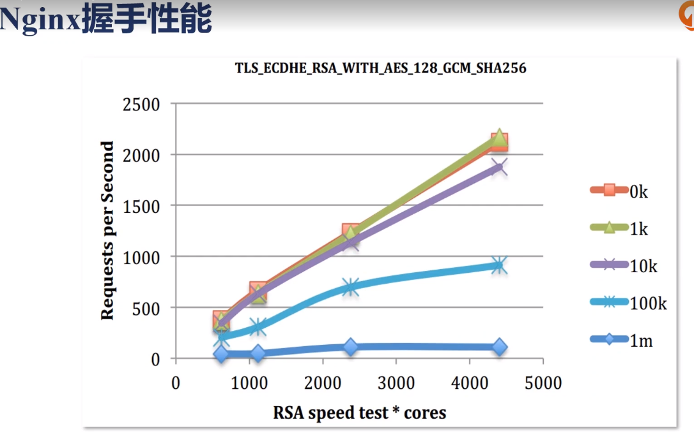

这里主要看它的算法性能。Nginx在握手的时候主要是看它的椭圆加密算法和RSA的性能。从上图中可以看到，对于小文件，握手是主要影响它QPS性能的主要指标。

Nginx数据加密性能如下图所示：

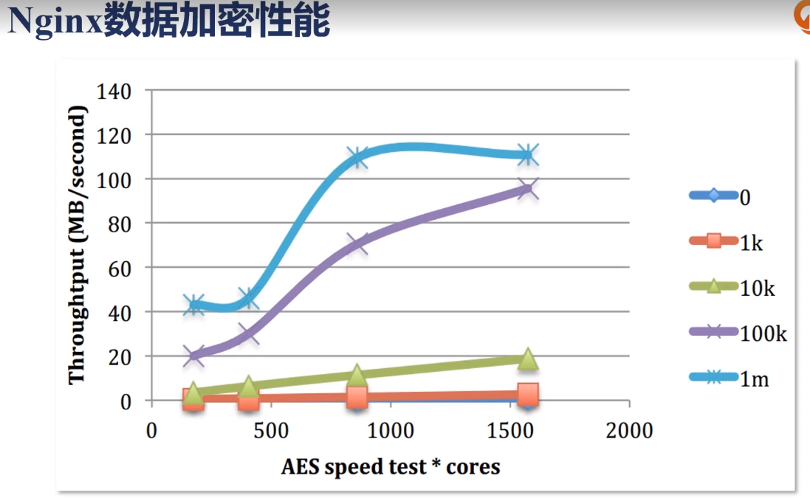

对于大文件，我们就要考虑对称加密算法的性能。比如AES。对称加密算法虽然性能很好，但对非常大的文件，我们去测吞吐量的时候，也可以看出相对于其他算法AES的性能还是比较好的，它能达到的极限在100以上，不到120.

Nginx的综合性能如下图所示：


当以小文件为主时，主要考验的是nginx的非对称加密的性能，比如RSA。当我们主要处理大文件时，主要考验的是对称加密算法的性能，比如AES。当我们面的场景是小文件比较多时，我们可以重点应该优化椭圆曲线的密码强度，看是否能有所降低。当主要面对大的文件处理的时候，我们主要考虑AES算法是否可以替换为更有效的算法，或者把密码强度调的更小一些。

## 2.16 用免费SSL证书实现一个HTTPS站点

使用Let's encrypt生成一个免费的DV证书。

nginx.conf中server_name会被Let's encypt自动脚本识别。

安装工具：

```bash
# yum -y install python2-certbot-nginx
```

工具安全好后，会提供一个cerbot的命令，使用方法如下：

```bash
# certbot --nginx --nginx-server-root=/usr/loca/openresty/nginx/conf -d geektime.taohui.pub
```

上面的命令执行过程会有提示，根据提示输入选择即可完成。

命令的执行主要完成的工作可以从配置文件中看出，在配置文件的server指令块中增加了5行：

```nginx
include vhost/*.conf;
server{
	server_name geektime.taohui.pub;
	listen 80;
	location / {
		alias html/geek/;
	}
listen 443 ssl; # managed by Certbot
ssl_certificate /etc/letsencrypt/live/geektime.taohui.pub/fullchain.pem; # managed by Certbot
ssl_certificate_key /etc/letsencrypt/live/geektime.taohui.pub/privkey.pem; # managed by Certbot
include /etc/letsencrypt/options-ssl-nginx.conf; # managed by Certbot
ssl_dhparam /etc/letsencrypt/ssl-dhparams.pem; # managed by Certbot
}
```

```
# vim /etc/letsencrypt/options-ssl-nginx.conf
# This file contains important security parameters. if you modify this file
# manually, Certbot will be unable to automatically provide future security
# updates. Instead, Certbot will print and log an error message with a path to
# the up-to-date file that you will need to refer to when manually updating 
# this file.

ssl_session_cache shared:le_nginx_SSL:1m; # 握手最消耗性能，所以为了减少握手，使用了cache. 1m可以为大约是4000个https连接服务
ssl_session_timeout 1440m; # 1440m也就是，一天，一天内密钥可以复用

ssl_protocols TLSv1 TLSv1.1 TLSv1.2;
ssl_prefer_server_ciphers on;
ssl_ciphers "ECDHE-ECDSA-CHACHA20-POLY1305:ECDHE-RSA-CHACHA20-POLY1305:ECDHE-ECDSA-AES128-GCM-SHA256:......." # 安全套件是有顺序的，代表使用的优先级
```

ssl_dhparam /etc/letsencrypt/ssl-dhparams.pem设置了非对称加密的参数，这些参数决定了网络安全的加密强度。

## 2.17 基于OpenResty用Lua语言实现简单服务

### 2.17.1 OpenResty安装实践

**下载OpenResty**

官方站点下载源码，解压进入源代码目录

```bash
[root@dev01 ~]# wget https://openresty.org/download/openresty-1.15.8.2.tar.gz
[root@dev01 openresty-1.15.8.2]# ll
total 100
drwxrwxr-x. 46 1000 1003  4096 8月  29 13:33 bundle
-rwxrwxr-x.  1 1000 1003 52432 8月  29 13:32 configure
-rw-rw-r--.  1 1000 1003 22924 8月  29 13:32 COPYRIGHT
drwxrwxr-x.  2 1000 1003   203 8月  29 13:32 patches
-rw-rw-r--.  1 1000 1003  4689 8月  29 13:32 README.markdown
-rw-rw-r--.  1 1000 1003  8972 8月  29 13:32 README-windows.txt
drwxrwxr-x.  2 1000 1003    52 8月  29 13:32 util
```

**分析目录结构**

openresty源代码目录相比少了很多东西，少的东西都移到`bundle`目录下。进入`bundle`目录，发现有一个`nginx-1.15.8`的目录，这说明没有出现在nginx 1.15.8版本中的特性，openresty中也不会有。`bundle`目录中的其他目录又分为2类：一类是nginx的第三方模块，通常是c代码模块，通常以ngx_开头。有的如memc-nginx-module-0.19也是c模块。另一类是lua模块。是用lua写的，它需要ngx_lua-0.10.15模块提供的一些功能。我们在编译的时候主要是编译c模块。

通过`./configure --help`可以发现openresty与nginx的configure没太大区别。只不过openresty集成了很多第三方模块。比如，http_echo_module, http_xss_module等，很多都是章亦春写的。http_lua_module, http_lua_upstream_module是openresty的核心模块，这些是不能移除的，否则openresty就没办法用了。

**编译**

```bash
# ./configure
# make install
```

**添加lua代码**

```nginx
server {
    server_name geektime.taohui.pub;
    listen 80;
    
    location /lua {
        default_type text/html;
        content_by_lua '
            ngx.say("User-Agent: ", ngx.req.get_headers()["User-Agent"])
            ';
    }
    locatioin / {
        alias html/geek/;
    }
}
```

不能直接把lua的语法添加到nginx.conf文件中。为了浏览器中能直接显示lua输出的内容，所以配置中添加了`default_type text/html`。

lua模块中提供了一些API，如`ngx.say`，生成http响应，也就是说`ngx.say`的内容是放到body中的，而不是放到header中的。body中的文本是可以通过ngx.say生成的。

`ngx.req.get_headers()`会取到http header的内容。

**运行**

# 3 Nginx架构基础

为什么要讨论Nginx的架构基础呢？因为Nginx运行在企业内存的最外层，也就是说边缘节点。那么它处理的流量是其他应用服务器的数倍，甚至是几个数量级。我们知道**任何问题在不同的数量级下，它的解决方案是不同的**。所以Nginx所处理的场景中，所有的问题都会被放大，所以我们必须要去理解为什么Nginx采用`master-worker`这样一种模型。为什么worker的进程数量要与CPU的核数相匹配。当我们需要在多个worker进程之间共享数据的时候，为什么在TLS，限流，限速这样的场景，它们的共享方式是有所不同的。这些都需要我们对Nginx的架构有个清晰的了解。

## 3.1 Nginx的请求处理流程

Nginx请求处理流程如下图所示：

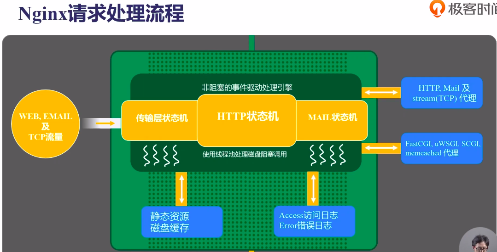

为什么我们要了解Nginx的处理流程呢？前面提到Nginx可以记录access日志，error日志，也可以处理静态资源，也可以做反向代理。这些功能我们可以从Nginx的内部去看，它是怎么处理这些请求的。

从上图左边可以看到有web, email, TCP大概三种流量进入Nginx。Nginx中有三个大的状态机：

- 处理tcp ， udp的四层传输层状态机
- 处理http的应用层状态机
- 处理邮件的mail状态机

为什么叫它们状态机呢？是因为Nginx核心(上图中绿色的框中)使用的是非阻塞的事件驱动处理引擎，也就是epoll。一旦使用异步处理引擎以后呢，通常都是使用状态机来把请求正确的识别和处理。当解析后是静态资源处理，就往静态资源，磁盘缓存的方向走。但当内存不足以缓存时，一些如sendfile，aio这样的调用会退化成阻塞的磁盘调用，所以在这里需要一个线程池来处理。对于每一个完成的处理请求，我们会记录access和error日志。

更多的时候Nginx是作为负载均衡使用，可以把请求通过协议机传输到后面的服务器。也可以通过应用层的一些协议fastcgi或Python的uWSGI等代理到相应的服务器。

## 3.2 Nginx的进程结构

Nginx有两种进程结构：一种是单进程结构；一种是多进程结构；单进程结构不适于生产环境，只适用于开发调试。因为生产环境需要保持Nginx健壮，且需要利用多核特性。多进程结构的架构模型如下图所示：


父进程master process有多个子进程child processes. 这些子进程分为两类：一类是worker进程；一类是cache相关的进程。为什么Nginx采用的是多进程模型而不是多线程模型？这主要是Nginx的最核心的目的是要保持它的高可用性和高可靠性，而当使用多线程结构的时候，多个线程之间是共享地址空间的，当某个第三方模块引发了一个地址空间导致的Segment fault时，地址越界出现时会导致整个Nginx进程全部挂掉。而采用多进程模型时，往往就不会出现这种情况。可见Nginx的进程架构选择也是为了保证其高可用高可靠，如在Master进程中，是不会加入第三方模块的代码的，虽然Nginx在设计中允许第三方模块在master进程中添加自己独有的自定义 的方法，但通常第三方模块不会这么做。master进程是用来做管理的，而worker进程是真正处理请求的。master进程负责监控worker进程是否需要重新载入配置文件，是否需要进行热部署。

而说道cahce缓存的时候，缓存实际上要在多个worker间共享的，而且缓存不光被worker进程使用，还要被CM，cache manager, CL cache loader进程使用。CM和CL也是为了做反向代理时后端发来的动态请做缓存使用的。CL做缓存的载入，CM做缓存的管理。实际上每一个请求处理使用的缓存还是有worker进程来进行的。那么这些进程间的通信都是通过共享内存来解决的。

为什么worker进程会有很多，而CM CL却只有一个？

这是因为Nginx使用了事件驱动模型之后，它希望每一个worker进程从头到尾都始终占有同一个CPU。所以除了需要将worker进程的数量配置成与CPU核数一致，还需要将worker进程与某一颗CPU绑定在一切，这样就可以利用每个CPU核上的CPU的缓存，这样减少缓存失效的命中率。

## 3.3 Nginx的进程结构实例演示

```bash
# ps -ef | grep nginx
```

使用上面的命令可以看到worker process, cache manager process的PID，以及其父进程master process 的PID。

我们知道`nginx -s reload`命令会优雅的退出worker process, cache manager process.然后使用新的配置项启用新的worker process , cache manager process.

虽然配置文件没有变化，但执行`nginx -s reload`之后，通过`ps -ef | grep nginx`可以看到worker process , cache manager process的PID是改变了。而master process的PID是没有改变的。

我们知道reload 与 HUP信号作用是相同的，现在向master process 发送信号：

```bash
# kill -SIGHUP 9170 (9170是master process的PID)
```

可以看到与reload作用是相同的。如果向某个worker进程发出退出的信号，那么这个worker进程会退出，但是在退出时，会自动向其父进程也就是master进程发送SIGCHILD，master进程收到这样的信号后，就直到它的子进程退出了，master会新起一个worker进程，这样维持worker进程数量不变。演示如下：

```bash
# kill -SIGTERM 16982 (16982是某个worker进程的pid)
```

上面的命令执行完成后，16982的进程没有了，但新其了一个PID为17004的worker进程。

所以命令行中的很多命令就是向master进程发送信号而已。

## 3.4 使用信号管理Nginx的父子进程

多进程间通信可以使用共享内存，信号等。当做进程间管理时通常只使用信号。Nginx进程管理使用的信号如下图：

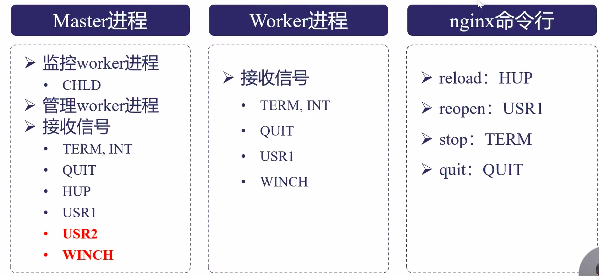

能够发送和处理信号的有master 进程，worker进程，及nginx命令行

**Master进程**

master进程可以启动worker进程，所以首先要监控。

- 监控worker进程：worker process 是否发送 CHLD信号。Linux系统规定，当子进程终止的时候，会向父进程发送CHLD信号。所以worker进程由于一些模块的bug导致worker进程意外终止，那么master进程可以通过CHLD发现这一时间，然后立刻拉起新的worker进程。

- 管理work进程

   * TERM, INT立刻停止Nginx进程
   * QUIT优雅的停止Nginx进程，所谓优雅就是可以慢慢的停，但是要保证不要对用户发送立刻结束连接，像TCP的reset复位请求这样的报文
   * HUP 重载配置文件
   * USR1 重新打开日志文件做日志文件的切割
   * **USR2** 针对做热部署时使用
   * **WINCH ** 针对做热部署时使用

  上面的6种worker进程管理信号的前4个可以同Nginx命令行加特定的命令直接向master进程发送的。而后面两个字体加黑的USR2 , WINCH只能通过kill命令行直接向master进程发送信号。也就是说要先找到master process的PID，通过kill发送信号。

- **worker进程**

  * TERM,INT
  * QUIT
  * USR1
  * WINCH

  为什么我们通常不直接对worker进程发送信号？因为我们希望由master进程来管理worker进程，所以对worker进程发送信号，Master进程会收到同样的结果，而我们通常管理master进程，Master进程收到信号后会去再把信号发送给worker进程。

- **Nginx命令行**

  nginx启动后，会将PID记录到一个文件中，通常是记录到nginx安装目录的logs目录下的nginx.pid文件中。此文件记录了master进程的PID。当我们执行`nginx -s`这样的命令时，Nginx工具命令行会去读取nginx.pid文件，然后发送对应的信号

  * reload: HUP
  * reopen: USR1
  * stop: TERM
  * quit: QUIT

## 3.5 reload重载配置文件的真相

当更了Nginx配置文件时，都会执行`nginx -s reload`.执行这个命令的原因是我们洗完Nginx不能停止服务，在处理新的请求的同时，把Nginx配置文件平滑从旧 的`nginx.conf`更少为新的`nginx.conf`。这样的功能对Nginx非常有必要，但往往会发现执行reload后Nginx的worker进程变多了，这是因为以老的配置运行的worker进程长时间没有退出。当我们采用stream做反向代理的时候，可能这种场景会更多。下面分析Nginx reload流程，优雅退出与立即退出的区别。

**Nginx reload流程**

1. 向master进程发送HUP信号(reload命令)
2. master进程校验配置语法是否正确
3. master进程打开新的监听端口。为什么会打开新的监听端口？可能是新的配置文件中引入了如443新的端口。子进程会继承所有父进程已经打开的端口。
4. master进程用新配置启动新的worker子进程
5. master进程向老worker子进程发送QUIT信号，优雅关闭。
6. 老worker进程关闭监听句柄，处理完当前连接后结束进程。

如图所示

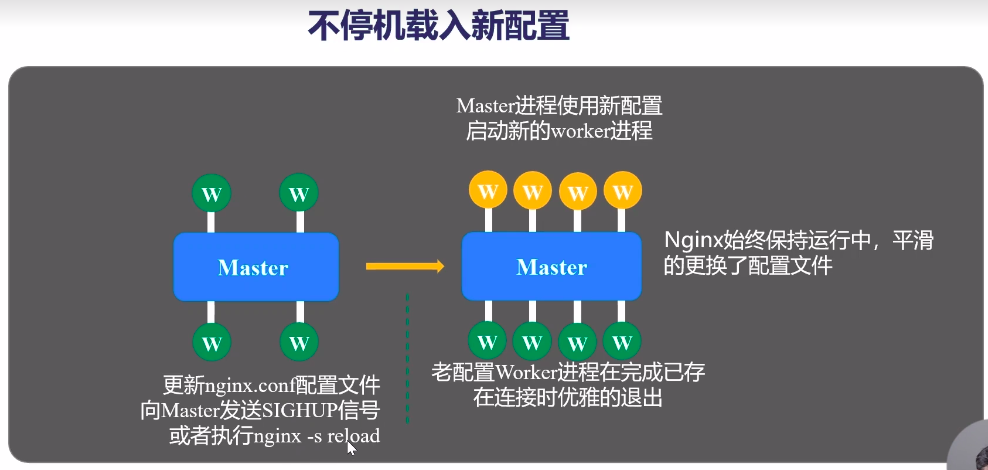

reload后会用新的配置起新的worker进程，此时新老worker进程会同时存在。老的worker进程处理完已连接的请求后会关闭连接，哪怕这个连接是keep-alived连接。但是异常的情况，如一些请求出了问题，如客户端长时间没有处理，会导致请求长时间占用在worker进程上，从而worker进程会一直存在。但新的连接已经跑在了新的worker进程上，所以影响并不是很大，只是老的worker连接会长时间占用。一些Nginx版本中加入了worker shutdown timeout配置。这样当timeout时间到了以后，如果老的worker进程还没退出的话，可以强制其退出。

## 3.6 热升级的完整流程

在Nginx不停止服务器的情况下，更新其二进制文件。更新过程中可能会遇到很多问题，如老的worker进程一直不能退出，或新的worker进程升级后出现了问题。所有要考虑回滚。或升级新的Nginx文件后，发现很多我们预期的功能或指向的配置文件出现了错误。热升级的流程如下：

**热升级流程**

1. 将旧Nginx二进制文件换成新Nginx二进制文件(注意备份)
2. 向现有的master进程发送USR2信号
3. 现有master进程修改pid文件名，加后缀 .oldbin
4. 老master进程用新Nginx二进制文件启动新Master进程，此时会出现老的master进程与新master进程共存，新master进程是老master进程的子进程。新的master进程会自动起新的worker进程
5. 向老master进程发送QUIT信号，老master进程优雅关闭老worker进程，此时老master进程还存在。为了方便回滚。关闭老master进程
6. 回滚：向老master发送HUP，向新master发送QUIT

流程图如下：

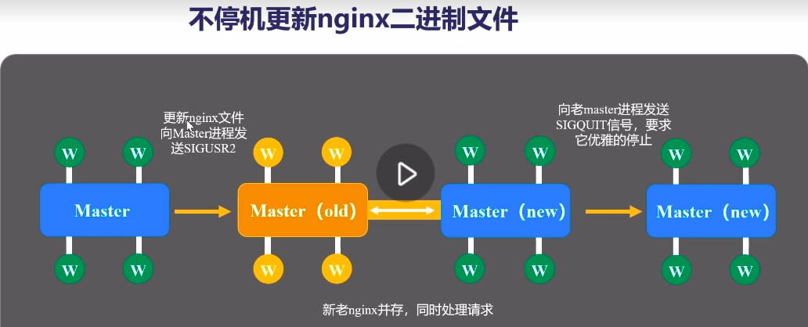

## 3.7 优雅地关闭worker进程

Nginx的停止方式有两种：`-s quit`和`-s stop`.其中stop是立即退出，quit是优雅退出。所谓优雅停止Nginx是怎样一个过程呢？

所谓优雅的关闭是对worker进程而言的，因为只有worker进程才会处理请求。如果在处理一个连接的时候，不管连接此时对请求是一个怎么样的作用，直接关闭连接会导致用户收到错误，所以优雅的关闭就是指Nginx的worker进程可以识别出当前的连接没处理请求，这个时候在把连接进行关闭。但对于有些请求Nginx做不到这一点。比如，当Nginx代理websocket协议时，websocket后面进行通讯的帧里面，Nginx是不解析它的帧的，所以这时Nginx是没有办法的。Nginx做tcp，udp反向代理时，它也没有办法识别一个请求需要经历多少报文才算是结束。但对于http请求，Nginx是可以做到的，所以优雅的关闭主要针对的是http请求。优雅的关闭流程如下：

**worker进程:优雅的关闭**

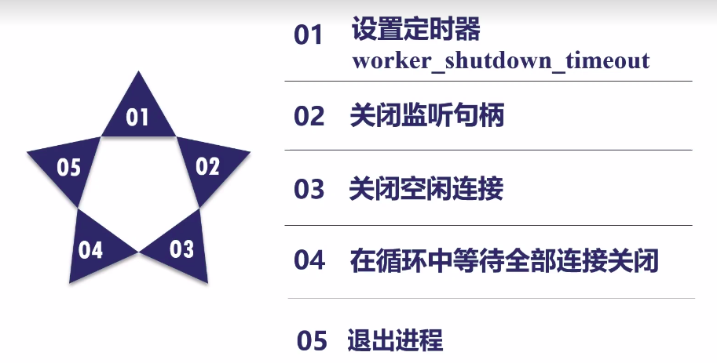

1. 首先设置定时器，就是在nginx.conf中的 `worker_shutdown_time`配置。设置定时器后，它会加一个标志位："我现在进入优雅的关闭这个流程了"
2. 关闭监听的文件句柄，保证不会再接受新的请求了
3. 接下来它会先看它的连接池，因为Nginx实际上为了保证自己对资源的利用是最大化的，它经常会保存一些空闲的连接，但是没有断开。此时会关闭所有的空闲连接
4. 可能是时间非常长的一步，因为Nginx不是主动的立刻关闭，所以通过第一步加的标志位，在循环中每当发现一个请求处理完毕，就会把这个请求使用的连接关掉。在循环中等待全部连接关闭的时间可能会超过第一步 的`worker_shutdown_timeout`。当设置了此配置时，达到超时时间，即使请求没有处理完，这些连接也会被强制关闭。也就是说优雅的关闭只完成了一部分，一部分连接是立即停止。所以当优雅的关闭所有的连接或达到超时时间，worker进程都会立即退出。

## 3.8 网络收发与Nginx事件间的对应关系

Nginx是一个事件驱动的框架，所谓事件主要是网络事件。Nginx的每个连接会对应两个网络事件：一个读事件，一个写事件。所以我们在深入理解Nginx的各种原理，以及其在极端场景，错误场景的处理时，我们必须理解什么是网络事件。网络传输的流程图如下：

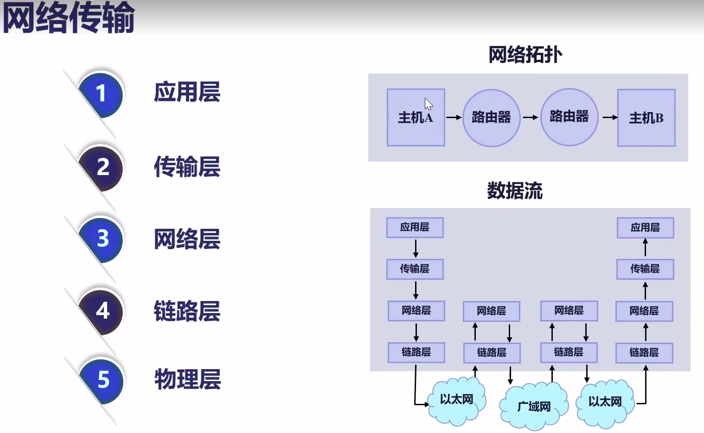

上图中假设主机A是家里的笔记本点，主机B是服务器，运行Nginx。从主机 A发送一个HTTP的get请求，到主机B，这样一个过程中究竟经历了哪些网络事件呢？

在上图中 的数据流程部分，应用层发送了一个HTTP请求，到了传输层，它主要做一件事情，就是我的浏览器打开了一个端口，我们从Windows的任务管理器中可以看到这一点。然后会把端口以及Nginx的端口如80 记录下来。再往下网络层会记录下我们主机的IP地址和目标主机即Nginx所在主机的IP地址。然后链路层经过以太网到达家里的路由器，家里的路由会记录下我们所在运营商的下一端的IP。经过广域网后，最终会跳转到主机B所在的机器中。这个时候报文会经过链路层，网络层，传输层。经过传输层后操作系统就直到数据是给打开了80端口的或443端口的进程。然后Nginx会在自己的HTTP状态机中处理这个请求。这样的一个过程中网络报文扮演了一个怎样的角色呢？tcp报文如下图：

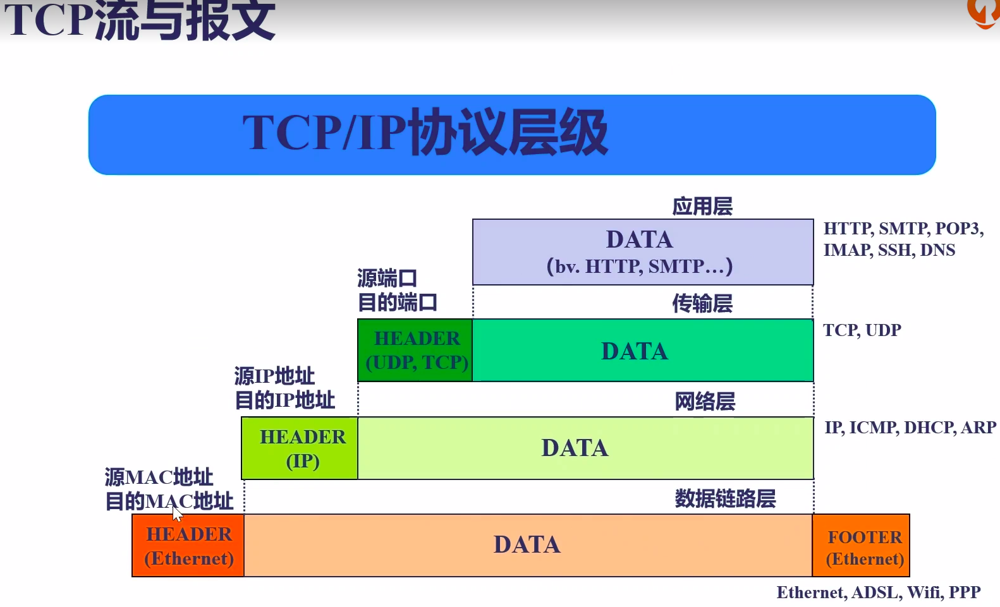

数据链路层会在我们的数据的前面header部分和后面footer部分添加源MAC地址和目的MAC地址。到了网络层会添加Nginx的公网地址和我们浏览器的公网地址。tcp层指定了Nginx打开的端口和浏览器打开的端口。应用层是我们的HTTP协议。上图就是一个报文，也就是我们发送的HTTP协议会切割成很多个小的报文。网络层会切割成MTU，以太网每个MTU是1500字节。在tcp层会考虑中间每个环节中最大的MTU值，这个时候，往往我们每个报文只有几百字节，这个报文大小称为MSS。所以没收到一个MSS小于这么一个大小的报文时，其实就是一个网络事件。这个时候再来看看tcp协议中许多事件是如何与我们日常调用一些 接口如accept,read,close这些事件关联在一起的。

**TCP协议与非阻塞接口**

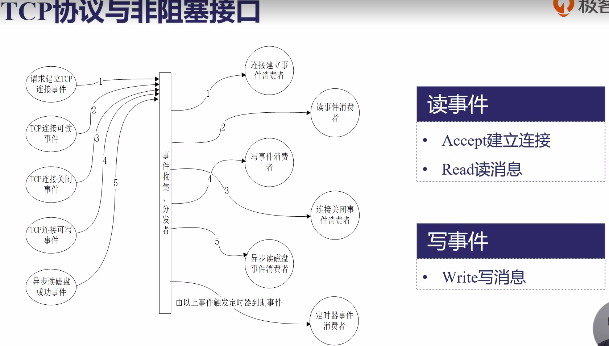

请求建立tcp连接事件，实际是发送了一个tcp的报文，通过上面讲的那样的流程到达了Nginx，所以它其实是一个读事件。因为对Nginx来说，我读取到了一个报文，所以是accept建立连接事件。

如果是tcp连接可读事件，也就是说我们发送了一个消息，对Nginx也是一个读事件，Read读消息。

如果是对端，也就是我们的浏览器主动的关掉了，相当于Windows操作系统会发送一个要求关闭连接的事件，对于Nginx来说还是一个读事件，因为它只是去读取一个报文。

那什么是写事件呢？当我们的Nginx需要想浏览器发送我们的响应的时候，我们需要把消息写到我们的操作系统中，要求操作系统发到网络中，这就是一个写事件。

像这样一些网络中的读写事件通常在Nginx中或在任何一个异步事件的处理框架中，会有一个东西叫做，事件收集分发器。我们会定义每一类事件它处理的消费者。也就是说事件是生产者，通过网络自动生成到Nginx中，我们对每种事件要建立一个消费者，比如连接建立的事件消费者，就是我们对accept调用，那么http模块会建立一个新的连接。还有很多读消息或写消息，那么在http状态机中不同的时间段我们会调用不同的方法，也就是每一个消费者去处理。那么以上就是一个事件分发消费器。包括像aio，异步磁盘读写事件，定时器事件，等都是有消费者。

## 3.9 Nginx网络事件演示

一个具体的抓包的例子来分析建立三次握手时，Nginx是怎么样读取事件的。

三次握手中的第二次，Nginx服务器回复SYN，ACK。此时Nginx并未感知到，因为此时处于半打开状态。直到客户端再次发送ACK到Nginx服务器，Nginx服务器操作系统才会通知Nginx，我们收到了一个读事件，这个读事件对应的是建立一个新连接。所以Nginx此时应调用accept方法去建立一个新的连接。

## 3.10 Nginx的事件驱动模型

Nginx是如何处理事件的？

**Nginx事件循环**

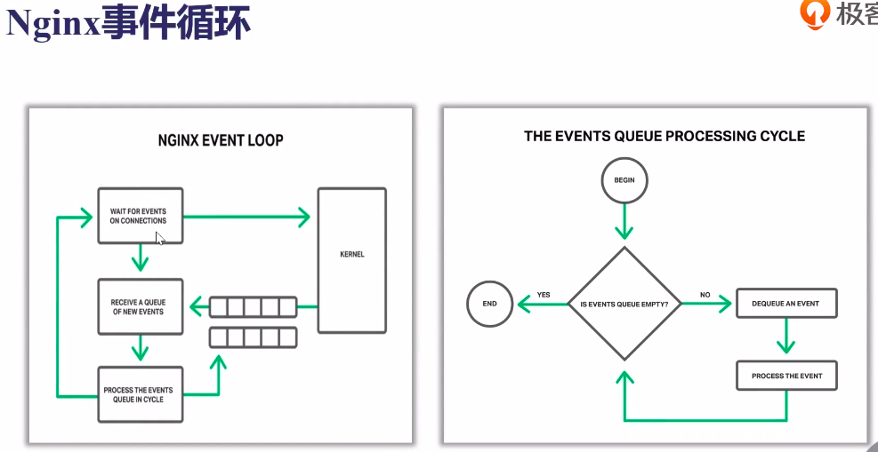

当Nginx刚刚启动时，处于`WAIT FOR EVENTS ON CONNECTIONS`，也就是说我们打开了80或443端口。此时在等待新的事件进来，比如新的客户端连上了我们的Nginx。这样的步骤往往对应着epoll中的epoll_wait方法。此时Nginx的进程状态处于sleep。当操作系统收到建立握手连接的报文，并处理完握手流程后，操作系统就会通知epoll_wait这个阻塞方法，告知其可以往下走了，并唤醒Nginx。向下走完后会向操作系统要事件。操作系统kernel会把其准备好的事件放到事件队列中。从事件队列中可以获取到我们要处理的事件，如建立连接。队列取出事件后，就会处理事件。在处理事件的过程可能会生成新的事件，如一个连接新建立了，需要添加一个超时时间。如60s.也就是说如果60s内浏览器不向我发请求的话，我就会把这个连接关闭。所以新生成的事件会放到一个队列中。 当所有事件处理完毕后，Nginx会返回到`WAIT FOR EVENTS ON CONNECTIONS`.

理解Nginx的事件循环是很有帮助的。比如有的第三方模块需要做大量的CPU运算，这样的大量CPU运算会导致我处理一个事件 的时间非常长。这样会导致上图中后续队列中的事件长时间得不到处理，从而引发恶心循环，也就是超时事件到。我们大量的CPU，Nginx的任务都消耗在处理连接不正常的断开。所以往往Nginx不能容忍有些第三方模块长时间的大量消耗CPU进行计算任务，就是这个原因。我们可以看到如gzip都不是一次使用大量的CPU，而是分段使用，都与这些有关。

## 3.11 epoll的优劣及原理

Nginx的事件循环流程中，最关键的是Nginx怎么能快速的从操作系统的Kernel中获取到等待处理的时间。这么一个简单的步骤其实经历了很长时间的解决。直到现在使用epoll这样一个模型。

epoll 的特点

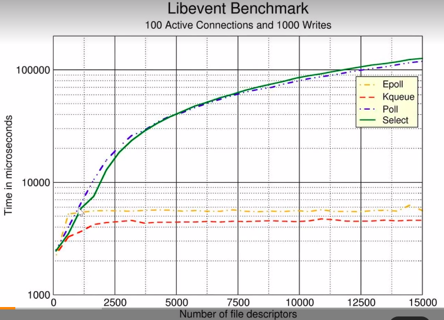

上图是libevent做的一个benchmark。它反应了当时一些常见的几种时间模型的性能。Kernel2.6之前的poll select的性能都是非常糟糕的。随着句柄数的增减，也就是并发数的增加，不同事件模型消耗的时间。

epoll使用场景如下图所示：

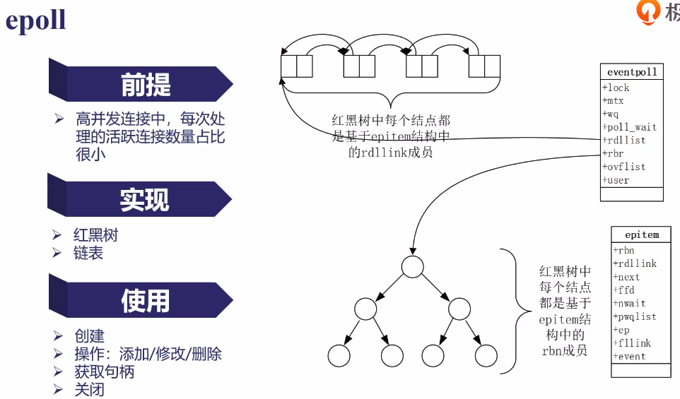

比如现在Nginx要处理100W个连接，那么从之前提到的事件分发图可以看到，我们每两次做等待新的连接中，时间可能会非常的段，这样在短短的几百毫秒这样一个量级的时间中，所能收到的报文数量是有限的，而这些有限的事件对应的连接也是有限的，也就是每次我处理事件时，虽然我总共有100W个并发连接，但我可能只接受到几百个活跃的连接，我只要处理几百个活跃的请求。而select或poll，它们的实现是有问题的。它们每次去取操作系统事件的时候， 我都需要把这100W个连接统统的扔给操作系统，让它依次判断哪些连接上面有事件进来了。所有操作系统做了大量的无用功。扫描了大量不活跃的连接。epoll就采用了这样一个特性，因为每次处理的活跃连接数量占比其实很小。

实现：维护了一个 数据结构，eventpoll。使用两个数据结构把这两件事分开了。也就是说我们的Nginx每次取活跃连接的时候，我们只要去遍历一个链表，这个链表仅仅有活跃的连接。这样我们的速度效率很高。我们还要经常操作的是什么呢？比如Nginx收到80端口建立连接的请求，连接成功建立后，要添加一个读事件。这个读事件是用来读取http消息的。这个时候我可能会添加一个新的事件，此添加会放到红黑树中，保证插入效率是logn,如果我现在不想处理读事件或写事件，只需要从平衡二叉树(红黑树)中移除一个节点就可以了。同样是logn的算法复杂度。

那么什么时候链表会有所增减呢？当我们读取一个事件的时候，链表中自然就没有了。当操作系统接受到网卡中发送的一个报文的时候，链表就会增加一个新的元素。所以在使用epoll的时候，它的操作：添加/修改/删除是logn的复杂度。而获取句柄的时候只是遍历rdllink(ready link)，只是把它读取出来而已，从内核态读取到用户态。

## 3.12 Nginx的请求切换

前面提到nginx如何使用epoll事件驱动框架的，下面看在请求切换这样的应用场景中，事件驱动带来的好处。请求切换如下图所示：

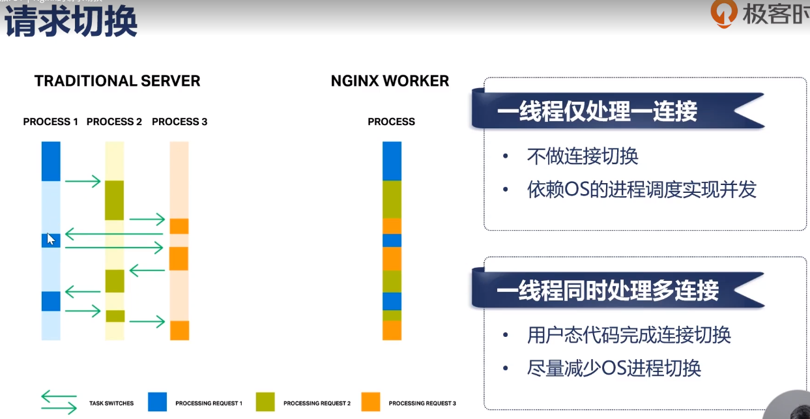

上图中有三个请求，分别用蓝色，绿色，和橙色表示。一个请求是http请求的话可以简化为3部分：1.收完header大概就知道应该交给上游服务器的谁来处理，利用负载均衡算法，向上游服务器建立连接。或本地处理的时候，判断header中是否有content-length，指明是否有body。如果有body的话，接下来会读下一个读事件，去处理完所有的http body。处理完body后可能还要发送一个http响应。在这样的一个过程中表现为3个事件，传统的服务如apache , tomcat, 它们在处理的时候，每一个进程process同一时间只处理一个请求。比如process1在处理request1的时候，当request1目前网络事件不满足的时候，就切换到process2,去处理process2上的request2。request2不满足的时候，如写一个响应，发现写缓存区已经满了，也就是说网络中已经比较拥塞了，所以我们的滑动窗口没有向前滑动，以致于我们调write方法，我们没有办法写入我们需要写入的字节。当write方法是非阻塞的时候。此时阻塞类的写方法一定会导致我们所在的进程又发生了一次切换。所以就切换到process3，操作系统选择process3，因为process3上的request3处于满足状态，可以继续往下执行，当执行到一定过程中呢，process3可能用完了它的时间片，此时process3又被操作系统切换。又切换到process1,如此往复下去。这里会有一个很大的问题，就是没做一次切换，消耗的时间大约是5微秒，5微秒虽然很小，但是并发的连接和并发的进程数开始增加的时候，它不是一个线性增加，而是指数增加。所以当连接数很多的时候，切换会消耗很大的计算能力。所以传统的web服务依赖操作系统的进程调度来实现它的并发连接数。而操作系统的进程调度仅适用于少量的进程，对于上百或上千的连接，进程调度的时间切换还可以接受。但对于上万，几十万，几百万的情况下就完全无法接受了。

nginx是如何处理的呢？

当蓝色的请求处理事件不满足的情况下，它的用户态就直接切换到了绿色的请求，这样就没有进程间切换的成本。因为网络事件不满足，除非nginx worker进程的时间片已到，时间片的长度一般是5毫秒到800毫秒，所以在nginx worker配置上，往往会把它的优先级加到最高，比如通常会加到-19，这样操作系统给我们分的时间片往往是较大的。这样nginx才能完全在用户态完成请求的切换，使得CPU少做无用功。

## 3.13 同步&异步、阻塞&非阻塞之间的区别

阻塞与非阻塞主要是指操作系统，或底层的C库提供的方法或系统调用，也就是说我们调用这个系统调用或方法的时候， 这个方法可能会导致我的进程会进入sleep状态。为什么会进入sleep状态呢？就是当前的条件不满足的情况下，操作系统主动的把我的进程切换为另外一个进程去使用当前的CPU。那么这样就是一个阻塞方法。而非阻塞方法呢，就是我们调用该方法永远不会因为当我们时间片未用完时把我们进程主动切换掉。

同步与异步：则是从我们调用的方式而言，就是我们编码中写我们的业务逻辑的角度。我们可以从nginx的发展历史趋势上看出这一点。nginx目前除了官方在提供的javascript利用同步写代码的方式实现非阻塞编码的效果，以及openresty基于lua语言用同步写代码的效果实现非阻塞高并发的效果。

阻塞调用方式如下图所示：

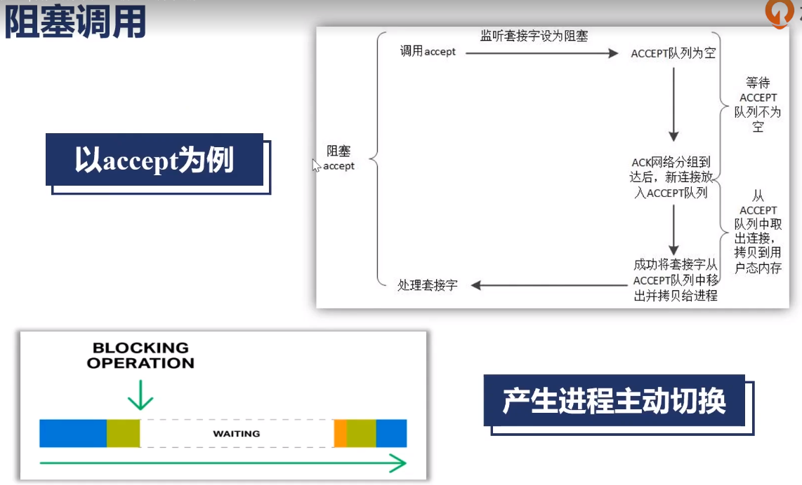

在阻塞调用中，以accept为例，因为绝大数程序在调用accept的时候都是在使用阻塞socket。使用阻塞socket时，当我们调用accept方法的时候，如果说我们监听的端口所对应的accept队列，就是操作系统已经为我们做好了几个三次握手建立成功的socket，那么阻塞方法可能会立刻返回，而不会被阻塞。但是如果accept队列是空的，那么操作系统就会等待新的三次握手的连接到达我们的内核中，我们才会去唤醒这个accept调用。这个时间往往是可控的，我们可以设置这个阻塞socket最长的超时时间，如果没有达到的话，也可以唤醒这个调用。所以这里的流程中就是会导致我们进程间的主动切换。而我们前面谈过，nginx是不能容忍这样的进程间切换的，因为它并发的连接实在是太多了。

非阻塞调用如下图所示：

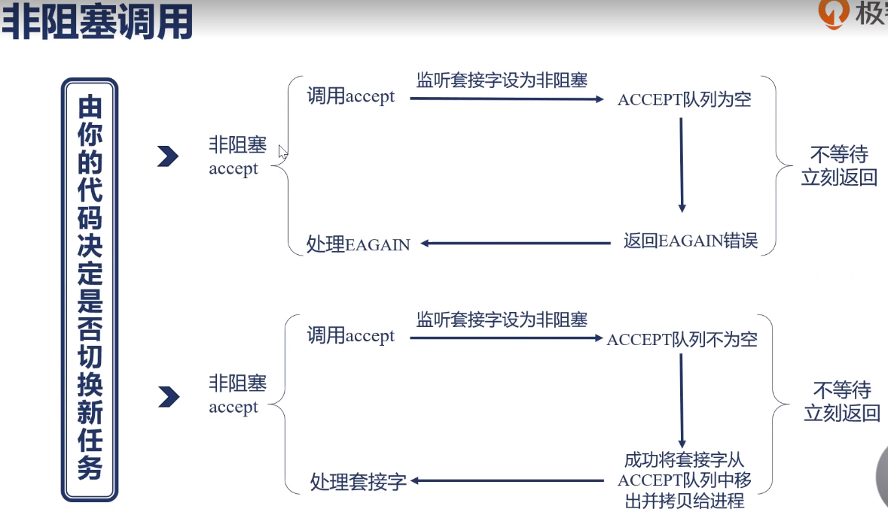

如果你使用的非阻塞套接字，使用accept调用去执行的时候，如果accept队列为空，它是不等待，立刻返回，但它返回的是EAGAIN错误码。这个时候我们的代码会收到一个错误码，但这个错误码是一个特殊的错误码，需要我们的代码去处理它。如果再次调用accept是非阻塞的，那么如果accept队列不为空，则把成功一个socket建立好的套接字返回给我们的代码。所以这里有个很大的问题，就是由我们的代码决定当accept收到一个EAGAIN这样的错误码时，我们究竟是应该等一会儿继续处理这个连接，比如sleep一下。还是切换到其他的任务再处理。这里举的是一个非常简单的accept的例子。如果涉及到我们的业务特性，比如http的复杂的子请求，主请求等等，实际上会导致我们的代码非常复杂，因此非阻塞调用呢是我们底层实现。如果我们用异步的方法去使用非阻塞调用是非常自然而然的。

下面是怎么样用异步的方式处理非阻塞连接的。

非阻塞调用下的同步与异步

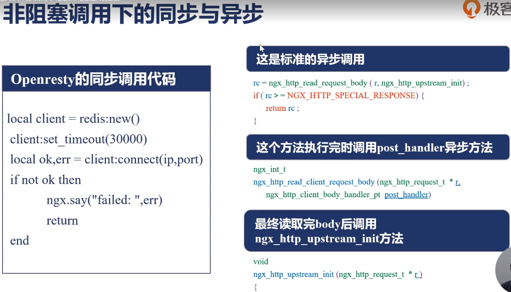

上面是一个反向代理的例子，nginx做反向代理的时候有个特点：它回去考虑到上游服务的处理能力相对是不足的，所以一个是有body的http请求，那么nginx会先把body接受完，再去向上游服务器发起连接。上图中标准的异步调用部分的代码中，当收完header的时候，我们已经知道接下来向谁，哪一台上游服务器去发起反向代理，建立连接。但是我需要先读取body，所以调用了ngx_http_read_request_body方法，这个方法就是一个标准的异步方法。它表达当我执行完read_request_body方法后，再去回调post_handler方法。也就是upstream_init是我们对上游服务器建立连接的方法。所以当我们调用这样一个异步调用的时候，意味着先把body收完，在调upstream_init方法，非常复杂，难以理解。

与这种异步调用相反的是上图中左半部分的同步调用方法，如使用Openresty写一段lua代码。比如要对redis建立连接，建立连接也是使用TCP，TCP同样有三次握手，三次握手其实这种报文。那么我们在基于nginx openresty上也是不能使用阻塞方法的。但用异步方式非常复杂。

同步方式我们可以看到,new一个client,设置好超时时间，我们就可以调用connect，这个connect就是一个同步调用，但它里面走的是非阻塞方法，所以我们在写lua代码的时候我们完全不必考虑向异步调用的那种方式。我们只需要简单的connect，收到响应值后。如果不是OK就打印failed就可以了。因为在connect方法执行的过程中，当connect没有被满足，也就是我们没有收到redis发来的ack响应，就是建立成功建立连接时，connect方法不会返回，但是也不会阻塞nginx代码。这就是同步调用，采用非阻塞的方式。

## 3.14 Nginx的模块究竟是什么

Nginx之所以有如此多的特性，是由于有大量的开发者开发第三方模块。Nginx之所以有如此丰富的生态圈，是因为其模块设计非常优良。比如TCP协议从上个世纪70年代至今没有大的变动。Nginx是一样的从2004发布第一个版本以来，它的模块没发生大的变化。Nginx模块有何高明之处？

**模块**

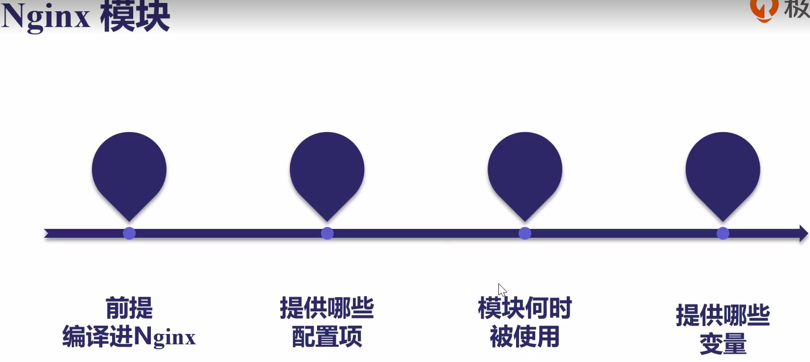

理解Nginx模块，首先我们要保证其必须编译到我们的Nginx binary文件中的。第二我们要了解此模块提供了哪些配置项。第三我们要了解此模块何时被使用。因为有的模块编译进Nginx默认就会使用，而有些模块必须使用响应配置项且配置正确时才能使用。第四这个模块提供哪些变量。

进入：nginx.org/en/docs/

官方模块都有详细的说明，比如做gzip压缩时，可以找到ngx_http_gzip_module.

Embedded Variables: nginx 提供的变量

`$gzip_ratio`

如何确定是否编译到二进制文件中：

在`config`执行完成后，去`objs`目录中，此目录下会生成一个ngx_modules.c . 此文件中有一个*ngx_modules[]的数组，此数组包含了所有编译进Nginx中的模块。其中可以找到&ngx_http_gzip_filter_module,这就是gzip模块。`cd src/http/modules/`, `vim ngx_http_gzip_filter_module.c`查看此模块的源码。此文件中搜索`ngx_command_t`结构体，它必须是唯一的。Nginx的每一个模块必须具备的结构体，它是一个数组，数组的每一个成员都是它支持的指令名，指令名后是其可以带的参数。这样即使文档中没有明确说明gzip模块支持哪些指令，也可以从这里的源码中看到。

**nginx模块是如何定义的**

Nginx模块组织示意图如下所示

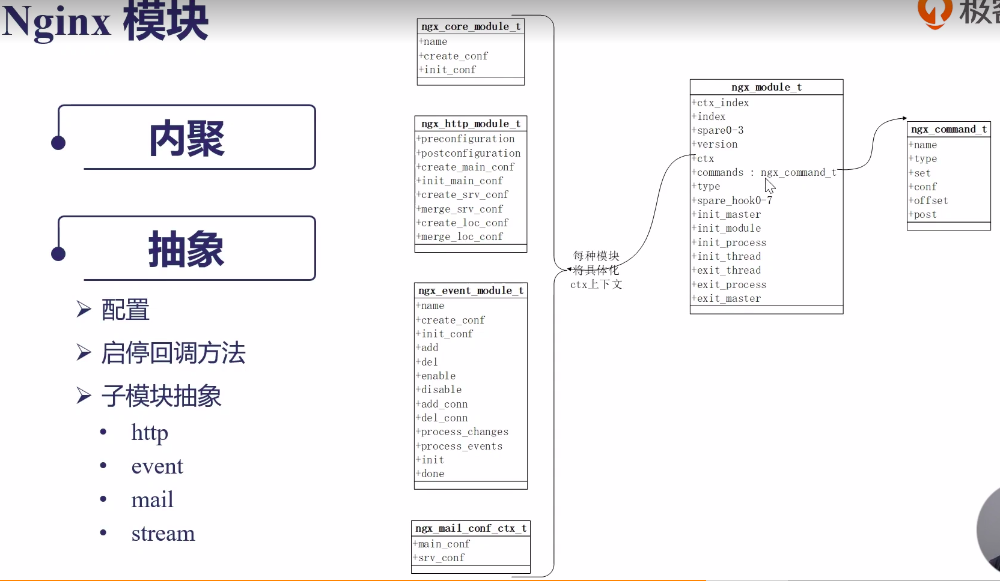

上图中的右边，类图中`ngx_module_t`就是每个模块用来说明它的结构体，此结构体中有一个成员是`commands`，就是上面提到的`ngx_command_t`。这个数组中，每一个数组元素就是一个指令，以及它所处理的方法，指令可以跟一些什么样的参数。`ngx_module_t`是通用的模块，但实际上有很多不同类型的应用，比如http, 比如stream，这是完全不同的应用，那么这一类应用中，每一种应用都有许多模块组成，所以我们把模块细分为子模块，比如`ngx_core_module_t`核心模块，`ngx_http_module_t`http模块，等都必须遵循同样的规则。每一类子模块会自己定义一些新的规则，比如http模块定义了8个回调方法，而event定义了时间相关操作的方法，`ngx_module_t`会定义所有模块的顺序，模块的顺序是非常重要的，它会决定有些模块如果跟其他模块有冲突的话，先生效的模块会阻碍后生效的模块发挥作用。

Nginx模块必须高内聚：响应独立的功能在模块的代码中

Nginx的抽象非常好：

- 配置：`ngx_command_t`
- 启停回调方法：`ngx_module_t`中的7种启停方法：包括Master进程刚刚启动的时候，worker进程将要启动的时候，还有worker进程将要退出的时候，Master进程将要退出的时候，都会提供回调方法。也就是说我们任何一个第三方模块都有机会在我们Master进程，worker进程执行reload，执行优雅退出，执行热部署的时候，加载自己的代码。所以有一些定制话的需求，希望在我们的集群在刚启动的时候，做一些什么样的事情，完全可以在回调方法中去做。

## 3.15 Nginx模块的分类

根据不同的具体场景，Nginx模块又细分为子模块。在特定的复杂的应用场景下，这些子模块会新增许多特性和功能。Nginx模块是如何划分子模块的呢？

上次提供Nginx有个数据结构叫`ngx_module_t`，它是每一个模块必须具备的数据结构。其中它有一个成员叫`type`，这个type定义了此模块属于那个类型的模块。主要有一下几种类型的模块：

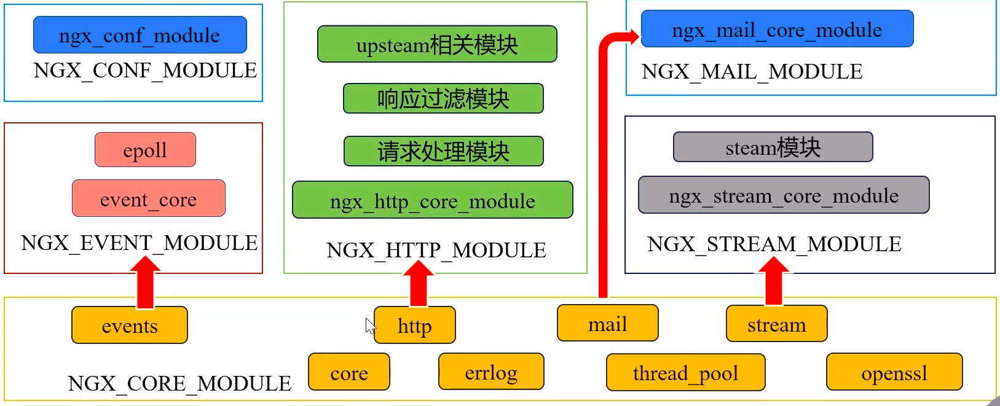

第一类模块：NGX_CORE_MODULE.核心模块。还有一个独立的模块叫NGX_CONF_MODULE.这个类型的模块只有一个模块叫`ngx_conf_module`。这个模块只是负责解析nginx.conf文件。核心模块中会有一类核心模块：events,http, mail, stream它们本身会定义出新的子类型模块，所以可以看出Nginx框架代码并没有去定义http业务或stream业务。而是通过某一类core module，它可以独立定义出新的子类型模块，我们可以看出Nginx的灵活性是非常强的。如果出现新出现了一类应用，可以通过新增一个ngx core module来定义新的应用模块。

所有处理事件的通用方法，我们把它内聚为事件模块，也就是NGX_EVENT_MODULE.每一类模块中总是有一些通用的共性的部分。其中这些通用共性的部分会放到xxx_core模块中，如event_core, http_core_module, mail_core_module,stream_core_module.前面提到每一个module都有一个Index，表示它的顺序。所以每一个子类型中的不同模块，同样是有顺序的，每一个子类型的core_module一定是排在第一位的，因为它定义了模块共同具有的一些特性。

最复杂的http模块，其中的core_module定义 了许多特殊的规则，比如当一个HTTP请求进入Nginx的时候，我们需要去为它生成响应，那么为请求生成响应的模块我们把它叫做：请求处理模块。当我们生成响应，把响应发送给浏览器的时候，我们可能要对响应中的一些特定的文件做一些特定的处理，比如说，如果我发的是css文件，那么对这个css文件做一次gzip压缩，那么我们的效率将会提高很多，因为它传输的信息的熵非常大。如果我发送的是一个图片，我需要对图片做一些裁剪缩放，那么我用image_filter模块也可以处理。所以响应过滤模块专注于把响应做二次处理。还有一类模块叫：upstream相关模块。当Nginx作为反向代理或正向代理，把请求传递给相关的服务处理的时候，那么这类模块都会由upstream相关的字样，他们专注于在一个请求内部去访问上游服务。其他的mail或stream相对比较简单。

通过源代码的目录结构来看子模块和源代码的对应关系。

```bash
# cd src
# ll
```

core - dir, Nginx的核心框架代码，并不是Nginx的core module

event, http, mail, stream - dir, 子类型模块

```bash
# cd http
# ll
```

在http模块中还有一些框架代码，这类代码不算模块，它是辅助于核心流程的。每一个子模块中都有一个核心模块，它定义了http的工作方式，也是放在http目录下，叫ngx_http.c 打开此文件，可以看到`ngx_module_t`结构体中，它的type叫`NGX_CORE_MODULE`。它定义了所有的http模块。所有框架类的代码，包括Nginx core module也是放在这个目录下的。而官方提供的非框架的，也就是说可有可无的模块，放到了modules目录下。里面有许多模块，刚才提到这些模块分为三类，一类是处理请求生成响应的，一类做响应过滤的，响应过滤的所有的模块会有filter关键字。还有一类与上游服务器发生交互的，比如upstram_hash, upstream_ip_hash,带有upstream关键字的都是在做负载均衡相关的工作。其他的模块都是生成响应的，或为生成响应而工作的。

如果我们看到了一个新的模块，一些第三方模块，那么首先应该看它属于哪一类模块，那么这一类模块还有一些共同的特性，可以帮助我们理解它。

## 3.16 Nginx如何通过连接池处理网络请求

之前谈到了Nginx的读写事件，这些网络读写事件究竟是怎样应用到Nginx上的？还有谈到Nginx使用了连接池来增加它对资源的利用率，其是如何使用的？

**连接池**

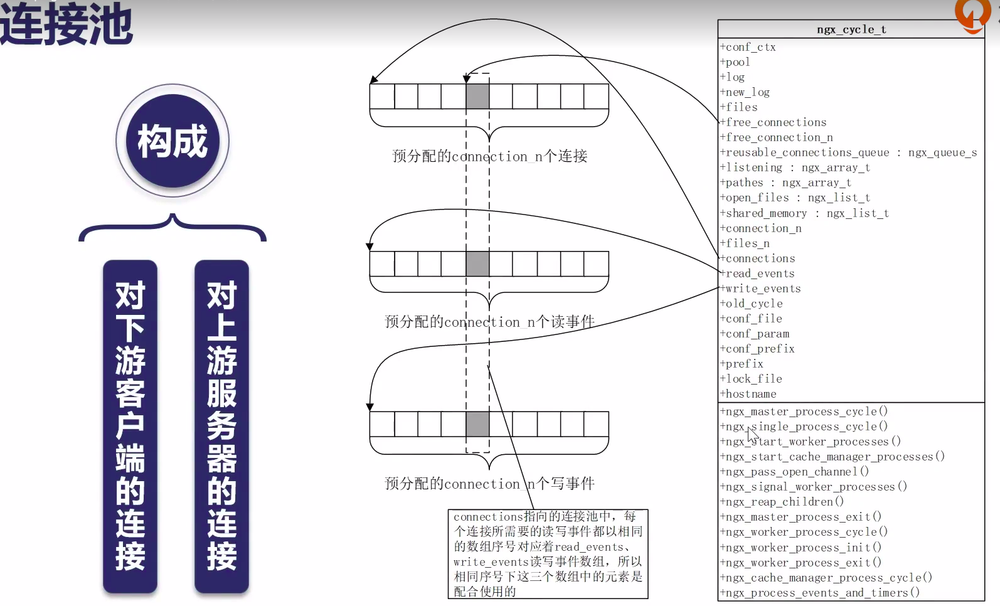

看一下右边这张图，每个worker进程都有一个独立的`ngx_cycle_t`数据结构。其包含一个数组`connections`，这就是所谓的连接池。它指向的数组有多大呢？在官方文档中有 个配置项，在core_module下的worker_connections,

```bash
Syntax: worker_connections number;
Default: worker_connections 512;
Context: events
```

默认会有512大小的数组，数组中每一个元素就是一个连接。默认值是较小的，因为Nginx动辄会处理万以上级别。这个连接不仅用于客户端的连接，还用于与上游服务器的连接。如果做反向代理，每个客户端意味着消耗2个连接。

每个连接自动的对应一个读事件和一个写事件，所以在`ngx_cycle_t`结构体中还有`write_events` , `read_events`.它们指向的数组的大小与worker_connections的配置是一样的。所以这三个是通过序号对应的。第5个连接自然就对应这第5个读事件和第5个写事件。所以在考虑Nginx能释放多大的性能时，首先把worker_connections保证足够使用。worker_connections指向的数组同时也影响了我们所打开的内存。当我们使用配置了更大的worker_connections，也就意味着Nginx使用了更大的内存。所以每一个connection到底用了多大的内存可以从下图中找到答案：

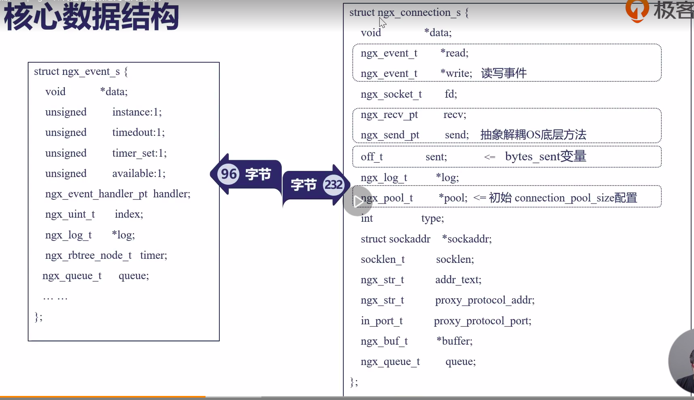

每个connectioin对应上图中的`ngx_connection_s`结构体。此结构体在64bit的操作系统中占用大约232bytes.具体的Nginx版本不同可能有微小的差异。每一个这样的结构体对应这一个读事件和一个写事件，之前谈到了Nginx网络事件的很多特性，在Nginx中每一个事件对应着一个结构体`ngx_event_s`。所以每个事件，也就是`ngx_event_s`结构体占用大约96字节。所以当我们使用一个连接的时候，它大概消耗的内存是232+96 * 2个字节。worker_connections配的越大，初始化的时候预分配的内存就越大。

`ngx_event_s`结构体中主要关注一下成员`handler`，这是一个回调方法，也就是说很多第三方模块会把这个`handler`设为自己的实现。还有一个timer成员，当我们对http做读超时，写超时等设置的时候，实际是在操作它读时间和写时间中的timer,其就是Nginx用来实现超时定时器的。这些定时器其实也是可配的。

在ngx_http_core_module模块中有很多定时器，如`client_header_timeout` . 默认是60秒，此60秒也就是我们刚刚在某个连接上准备读取它的header时，添加了一个60秒的定时器。

当多个事件形成队列的时候，可以使用`ngx_queue_t queue`形成一个队列。

当需要配置高并发的时候，必须保证worker_connections足够大。但也会带来一定内存消耗。

## 3.17 内存池对性能的影响

在写第三方模块的时候，虽然是用C语言写，但是并不关心内存的释放。如果你在配置Nginx一些罕见应用场景，你可能需要修改Nginx在请求和连接上初始分配的内存池大小， 但是Nginx官方上可能会写着通常不需要去改这样的配置，那究竟要不要改内存池大小呢？接下来看看内存池是如何运转的？

上一节中的核心数据结构中`ngx_connection_s`结构中的一个成员变量`*pool` ，它对应此连接使用的内存池，这个内存池可以通过`connection_pool_size`配置项去定义。那么我们为什么需要内存池呢?如果我们有一些工具的话，我们会发现，Nginx它产生的内存碎片是非常小的，这就是内存池的功劳。内存池会把内存提前分配好一批，而且当我们使用小块内存的时候，它会用next指针连接在一起，每次使用的东西比较少的时候呢，第二次再分配小块内存会连在一起去使用，这样大大减少了内存碎片。当然如果分配大块内存，还是会走到操作系统alloc去分配大块内存。这对于Nginx有什么好处呢？

内存池示意图如下：

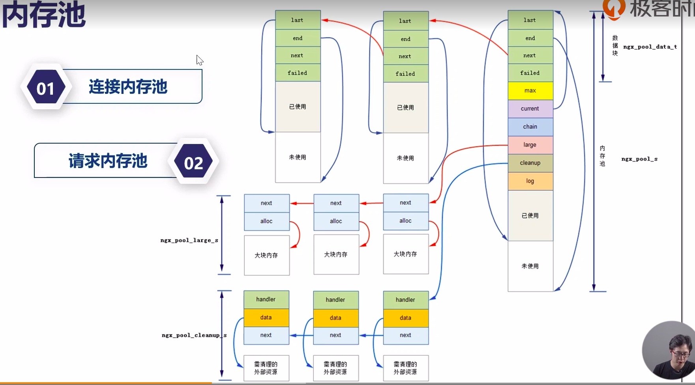

因为它主要在处理web请求，web请求特别对于http请求，它有两个非常明显的特点，就是每当我们有一个tcp连接的时候，那么这个tcp连接上面可能会运行很多http请求，也就是所谓的http keep-alive请求，连接没有关闭，执行完一条请求以后，还负责执行另外一条请求。那么有一些内存呢，我为连接分配一次就够了。比如说我去读取每一个请求的前1k字节，那么连接内存池上我分配一次，只要这个连接不关闭，这段1k的内存我永远不需要释放，直到连接闭关时释放。

请求内存池呢，每一个http请求，我开始分配的时候呢，不直到分配多大。但是http请求，特别是http1.1而言，通常我会分配4k大小的内存，因为我们的url或header往往需要分配那么多。如果没有内存池呢，我们可能需要频繁的分配，小块的分配。而分配内存是有代价的，而一次性分配较多的内存就没有这样的问题。而请求执行完毕以后，哪怕连接我们还可以复用，我们也可以把请求内存池销毁。而这样所有Nginx第三方模块开发者，他们就不必关注内存什么时候释放，他只要关注我是从请求内存池中申请分配的内存，还是从连接内存池中申请分配的内存，只要这个逻辑上讲的同，比如说请求结束以后，连接内存池想继续使用，那么你可以在连接内存池中分配。

在官方文档ngx_core_moduel中有一个connection_pool_size，默认情况下为256或512，与操作系统的位数有关。那么内存池配置512并不代表在这里我们只能分配512字节。当分配的内存超过预分配的大小的时候， 还是可以继续分配的，这里只是说因为我提前预分配了足够大小，可以减少我们分配内存的次数。

另一个配置request_pool_size,也就是说每一个请求的内存池的大小，其默认大小是4K，为什么差距会这么大呢？之所以会差距8倍，是因为对于请求而言，它需要保存的上下文信息非常少，它只需要帮助后面的请求读取最初的一部分字节就可以了。而对于连接而言，我们需要保存的大量的上下文信息，比如说所有读取到url, header我需要一致保存下来，url通常还比较长，所以我们需要4K. 当然官方文档说，它对性能的影响比较小，如果我们在极端场景下，如果你的url特别大，你可以考虑把request_pool_size分配的更大。或者你的内存很小，url非常小，header也非常少，你也可以考虑将其调小，这样Nginx消耗的内存更小一下，意味着你可以做更大并发量的请求。

内存池对减小内存碎片以及第三方模块开发是非常有意义的，可能有一些第三方模块不当使用了内存池，比如本该在请求内存池中分配内存，却在连接内存池中分配内存，这可能导致内存延期释放，导致Nginx内存无谓的增加。

## 3.18 所有worker进程协同工作的关键:共享内存

Nginx是多进程程序，不同的worker进程间要共享数据只能通过共享内存。Nginx共享村内是如何使用的呢？请看下图：


Nginx进程间的通讯方式主要有两种：

1. 信号：之前有提到如何管理Nginx的过程中已经介绍过。
2. 共享内存：如果要做数据的同步，只能通过共享内存。所谓共享内存，也就是说我们打开了一块内存，比如10M，一整块0-10M之前，多个worker进程之间可以同时访问它，包括读取和写入。那么为了使用好这块共享内存，就要引入两个问题。第一个问题：**锁**。多个worker进程同时操作一块内存，一定会出现竞争关系，所以我们需要加锁。在Nginx的早期，还有基于信号量的锁，信号量是Linux系统中比较久远的进程同步方式，它会导致你的进程进入休眠状态，也就是放生了主动切换，而限制大多数操作系统版本中，Nginx使用的锁都是自旋锁，而不是基于信号量。自旋锁呢，也就是说当这个锁的条件没有满足，比如说这块内存现在被1号worker进程使用，那么2号worker进程需要获取锁的时候，只要1号进程没有释放锁，2号进程会一直不停的请求这把所，就好像如果是基于信号量的早期的Nginx锁，那么假设这把锁锁住了一扇门。如果worker进程1已经拿到了这把锁，进到了屋里。那么worker进程2试图去拿锁，敲门发现里面已经有人了，那么worker进程2就会就地休息。等待worker进程1从门里出来以后通知它。而自旋锁不一样，worker进程2 发现门里已经有worker进程1了，它就会一直在敲门。所以使用自旋锁要求所有的Nginx模块必须快速的使用共享内存，也就是快速的取得锁以后，快速的释放锁。一旦出现有第三方模块不遵守这样的规则就可能导致出现死锁，或者性能下降的问题。那么有了这么一块共享内存，会引入第二问题：**Slab内存管理器**.因为一整块共享内存往往是给许多对象同时使用的。如果我们在模块中手动的去编写分配，把这些内存给到不同的对象是非常繁琐的，所以这个时候我们使用了Slab内存管理器。那么Nginx哪些模块使用了共享内存呢？见下图：

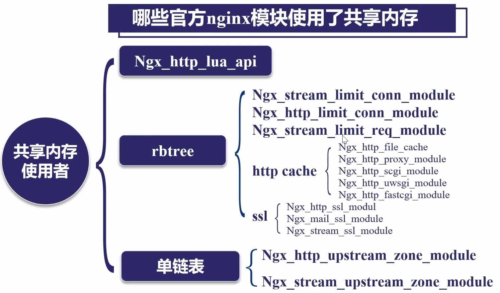

官方常用Nginx模块使用共享内存如上图所示。使用共享内存主要使用两种数据结构：

- rbtree, 红黑树。比如我们想做限速或流控等等场景时，是不能容忍在内存中做的，否则一个worker进程对某一个用户触发了流控，其他的worker进程还不知道，所以在共享内存中做。比如说limit_conn , limit_req, http cache , ssl. 红黑树有一个特点就是它的插入删除非常的快。当然也可以做遍历。所以这些模块都有一个特点，我需要做快速的插入和删除，比如我现在发现了一个客户端，我对它限速，限制达到后，我需要把这个客户端从限速数据结构中容器中移除，都需要非常的快速。
- 单链表。第二个常用的模块是单链表。也就是说我只需要把这些需要共享的元素串起来就可以了。比如http_upstream_zone_module, stream_upstream_zone.一个稍微复杂的例子是http_lua_api.这个模块实际上openresty的核心模块。openresty在这个模块中定义了一个sdk，叫`lua_shared_dict`。当这个指令出现的时候，它会分配一块共享内存，这块共享内存会有一个名称。下图是一个openresty共享内存代码示例。

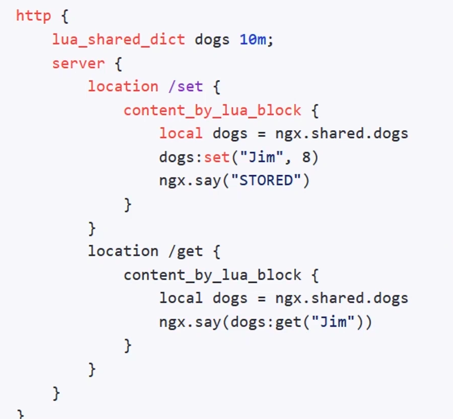

上面的代码中同时使用了rbtree和单链表。`lua_shared_dict dogs`使用红黑树保存key value.红黑树中的每一个节点是Jim, value是8. 为什么还需要一个链表呢？是因为10M是有限的，但我们的lua代码涉及到了应用代码，因为业务代码很容易就超过了10M的限制，当出现限制的时候，我们有很多处理方法，比如写入失败。但是lua_shared_dict采用了另外一种方式，就是使用LRU淘汰。也就是set或get长时间不用的最早的那个，在达到10M限制后会被淘汰。lua_shared_dict中对共享内存的使用同时满足了红黑树和链表。

共享内存是Nginx跨worker进程通信的最有效的手段。只要我们需要让一段业务逻辑在多个worker进程中同时生效。比如在许多做集群的流控上，那么必须使用共享内存，而不能在每一个worker进程中操作。

## 3.19 用好共享内存的工具: Slab管理器

前面提到多个worker进程通过共享内存通信，共享内存使用链表和rbtree数据结构。但是每个rbtree上有很多个节点，都需要分配内存去存放，怎样把一整块共享内存切割成小块给红黑树上的每个节点使用呢？使用slab管理器应用于共享内存。Slab内存管理形式如下图：

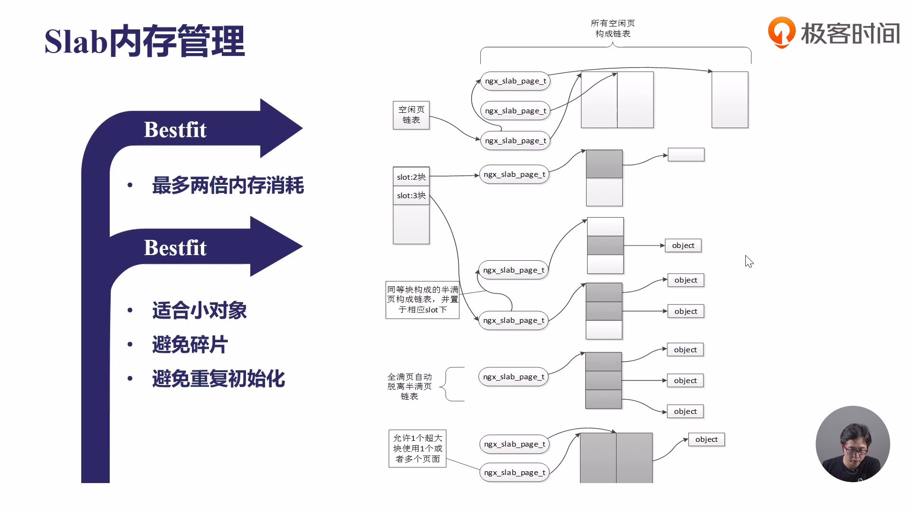

它首先会把整块共享内存分为很多页面，每个页面(如为4K)会且分为很多slot，比如32字节是一种slot，同样64,128字节也是一种slot,这些slot是以乘2的方式向上增长的，如果现在有一个51字节需要分配的内存，会放到64字节的slot中。slot是指向不同大小的内存块。这样的数据结构会有内存的浪费。比如51字节会占用64字节的slot存放，其他13字节会浪费。这种分配内存的方式是bestfit, 适合小对象。

**统计Slab使用状态**

Tiengine有一个模块叫ngx_slab_stat，用于监控slab使用状态：

```bash
$ curl http://localhost:80/slab_stat
```

可以看到不同的slot分配 了多少，使用了多少。

那如何在openresty场景下使用Tengine的这个模块呢？

打开tengine页面：tengine.taobao.org/document/ngx_slab_stat.html

但页面中没有此模块的github地址，这意味着它没有作为一个独立的模块提供出来。那就把整个Tengine包下载下来。比如Tengine-2.2.2.tar.gz,然后解压。可以看到其有一个modules目录。modules目录下有一个ngx_slab_stat目录。可以看到这个一个标准的Nginx第三方模块。因为每个第三方模块会通过一个.c的文件定义好之前提到的`ngx_module_t`的结构体。并有一个config来帮助它编译到Nginx中。先在回到openresty中，在编译的时候将tengine的这个模块编译进去。然后在使用openresty中的shared_dict分配共享内存，在用slab_stat去查看共享内存的使用情况。

```bash
# cd openresty-1.13.6.2
# ./configure --add-module=../tengine-2.2.2/modules/ngx_slab_stat/
```

--add-module参数可以将一个有config配置项的目录添加到Nginx中。也就是将目录中的源码使我们的config识别到。

```nginx
location = /slab_stat {
    slab_stat;
}
```

Slab内存管理使用了bestfit思想，也是Linux操作系统中经常使用的内存分配方式。通常使用共享内存时，都需要使用slab_stat去分配相应的内存给对象，在使用上层的数据结构来维护这些对象。

## 3.20 哈希表的max_size与bucket_size如何配置

Nginx容器是Nginx许多高级功能实现的基础。即使我们不需要编写第三方模块或查看Nginx的源代码，但我们需要变更Nginx的配置文件，以达到最大性能，我们也需要了解Nginx容器是怎样使用的。Nginx最主要的容器有6个：


首先是数组，ngx_array_t.这里的数组与平常我们说的数组还是有区别的。它是多块连续内存，其中每块内存中可以存放许多元素。而链表就是ngx_list_t.队列是ngx_queue_t。Nginx的很多数据结构中都有相应的这样的数据结构，这些结构体他们所实现的功能是类似的，只不过操作方法有所不同。Nginx中最重要的两个数据结构：一个是哈希表，一个是红黑树。重点介绍这两种。基数树是自平衡排序二叉树的一种，只不过它的key只能是整型。所以像geo等模块在使用基数树，其他使用基数树的场景并不多。

哈希表使用时有什么注意事项？

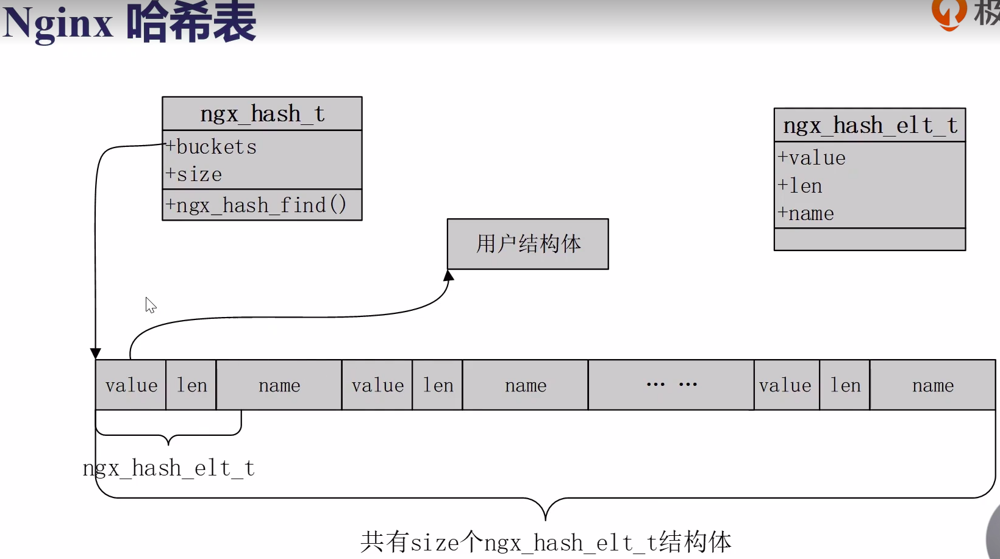

Nginx的哈希表跟我们正常所见到的哈希表还是有所不同的。我们先从其实现层面来看，与正常的哈希表是相似的，就是每一个元素会顺序的放到一块连续 的内存中，每个元素它的key同样是通过哈希函数来映射的，如上图中name就是它的key, value是一个指针指向我们实际的内存。每个key与另一个key是连续的放到一起的。这与大部分哈希表是一样的。那Nginx哈希表与常见的哈希表有哪些不同呢？

首先是应用场景不同，它仅仅应用于静态不变的内容。也就是说在运行过程中哈希表通常不会出现插入和删除的。也就是说我们的Nginx刚启动的时候就可以确定哈希表中一共有多少个元素，所以当使用哈希表的这些模块通常会暴露出来max size 和 bucket size连个参数，如下图：

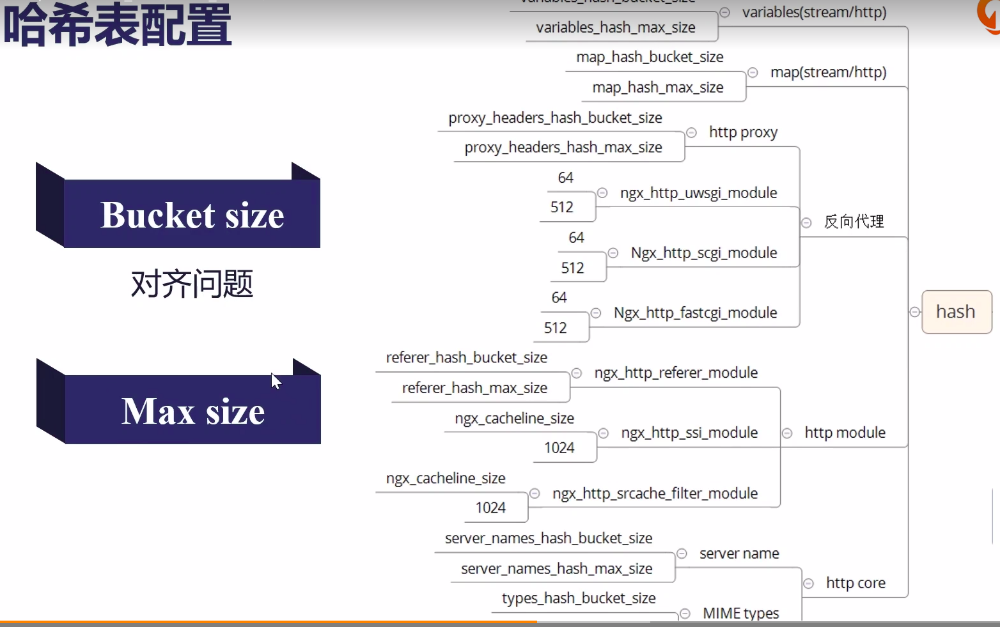

max size参数仅仅控制了最大的哈希表bucket个数，而不是实际上哈希表bucket个数。max size的意义在于限制最大化的使用，毕竟是要消耗内存的。所有使用哈希表的模块有什么特点？比如在stream或http的核心模块里，他们对所有的变量使用了哈希表。因为变量在我们模块编译进Nginx的时候就已经定义清楚了。还有对map也使用了哈希表。还有反向代理，因为反向代理中我们需要对很多header在配置文件定义好的header做哈希来提升它的访问性能。那么后面的refere, ssl也是同样的道理。因为哈希表它在访问的时候实际上是一个O(1)的算法复杂度，速度非常快。而哈希表中有一个bucket size, bucket size 中往往会有一些默认值，这些默认值有时候我们会发现Nginx的配置文档中说是cpu cache line,会对齐到这样一个值，这是指什么意思呢？这实际上影响了我们怎样去配置bucket size.也就是说现在主流的CPU实际上是有L1 L2 L3缓存的，它在取主存也就是我们内存中的数据时，并不是按照通常想象的那样按所有的64位或32位这样去取。现在主流的CPU一次取的字节数就是CPU cache line，现在是64字节。而为什么哈希表要向64字节对齐呢？这是因为假设我们现在每一个哈希表的bucket是59字节，如果我是紧密的排列在一起的，那么取第一个哈希表的元素，只需要访问一次，还多取了一个字节。但取第二个元素的时候，实际上访问需要组成两次，包括第一个64字节中的最后一个字节，以及第二个单元中的58字节。所以为了避免这种取两次的问题，Nginx在其代码中自动的向上对齐了，所以我们在配置bucket size的时候需要注意两个问题：第一，如果我们配置的部署CPU cache line,比如配置了70字节，它就会向上给我们分配的是每个元素使用128字节；第二，如果有可能的话，尽量不要超过64字节。以减少CPU访问我们每个哈希表元素的次数。

总结：使用哈希表需要注意：第一，哈希表只为静态的不变的内容服务；第二，哈希表的bucket size 需要考虑cpu cache line的对齐问题。

## 3.21 Nginx中最常用的容器: 红黑树

之前提到Nginx多个worker进程间通信的时候经常在共享内存上使用红黑树来管理许多对象。实际上在Nginx内存中也会大量使用红黑树。提到红黑树先看下图：

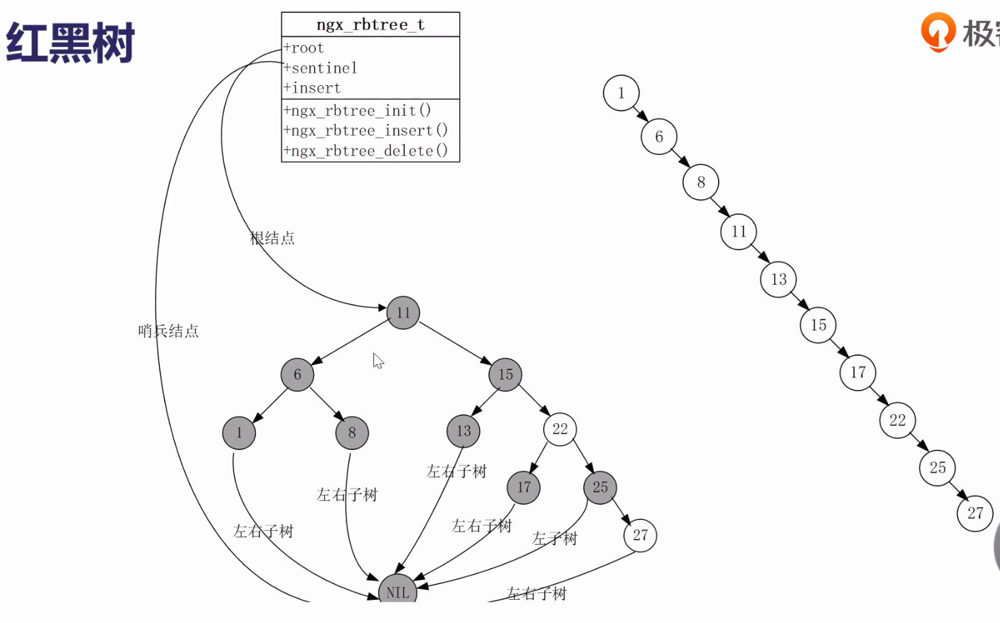

红黑树首先是一个二叉树，就是每一个节点有两个子节点。红黑树的第二个特点是，它是一个查找二叉树，所谓查找呢，就是有顺序的。也就是左边的节点要小于右边的节点。所有的节点都满足这样一个特性。那么这样的一个二叉查找树有可能退化为一个链表，比如上图中右边的图，也是一个二叉查找树，只不过他们都没有左子节点。而且他们都符合右边的节点大于左节点也大于根节点。此时遍历的时间复杂度是O(n). 而红黑树有一个明显的特点，就是它的高度差不会太大。

在Nginx中描述每一个红黑树有一个数据结构叫ngx_rbtree_t，它 的root节点就指向了红黑树 的根节点。红黑树会提供一些方法。红黑树里很容易的找到它 的最小节点，也就是最左边的子节点。用红黑树做定时器的时候经常使用这样一个特性。红黑树还有下图所示的优点：


1.其高度不会超过2倍的log(n),n是其节点数。

2.对红黑树做增删改查其算法复杂度是O(log(n))

3.遍历复杂度是O(n)

哈希表遍历的复杂度不是O(n),而是其backet数量。

有了这些特点，我们就可以判断当使用了红黑树的一些模块，我们进行增删改查时可以与测效率是很高的。而且，如果其提供了遍历的方法，我们也可以使用，特别是针对于ngx_lua模块，由于lua模块的底层实现不太清楚，但如果我们直到它是基于红黑树实现的，比如说前面提到的shared_dict,我们就可以放心的使用遍历和增删改查操作。使用红黑树的模块实际非常多，以下是官方常用模块中使用了红黑树的模块：

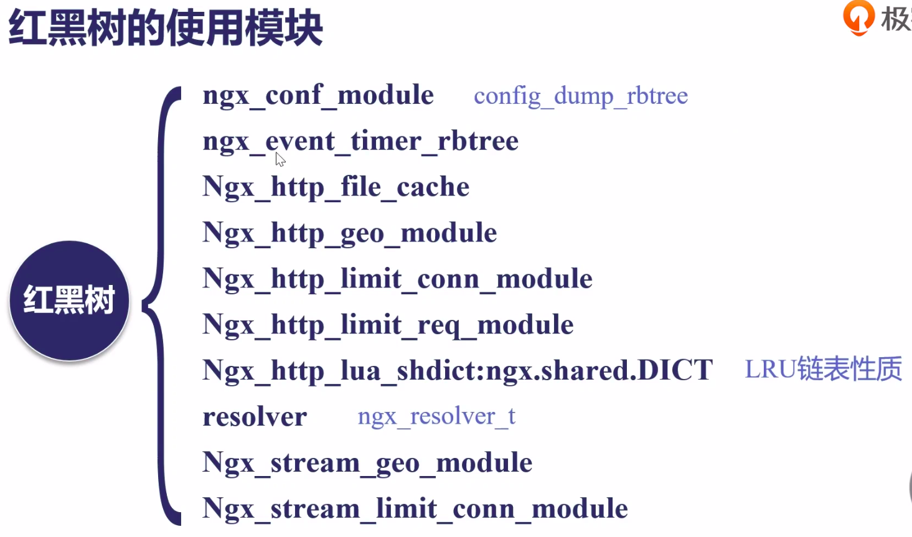

上图中有的不是模块，如ngx_event_timer_rbtree,但是所有worker进程都会有的，就是管理定时器的红黑树。ngx_http_file_cache，http_geo_module,limit_conn, limit_req,share_dict这些都是基于共享内存在使用红黑树。而上面的timer，config是在本地的内存使用红黑树。

小结：了解了红黑树的很多特性，就可以放心的使用红黑树中提供的很多方法，而不用纠结这样一个方法我频繁的调用会不会产生性能问题。

## 3.22 使用动态模块提升运维效率


# 4 详解HTTP模块


# 5 Nginx的系统层性能优化


