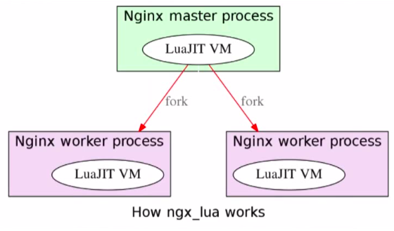

# 1 Openresty简介

## 1.1 高性能

这里的高性能是与编程语言无关的，不是只那个编程语言的性能高。

这里只的是高性能服务端，高性能服务端有２个非常重要的因素：

- 缓存
- 异步非阻塞

### 1.1.1 缓存速度

内存 > SSD > 机械磁盘

本机 > 网络

进程内 > 进程间

### 1.1.2 异步非阻塞

采用时间驱动的方式，而不用一直等待

## 1.2 Openresty

openresty颠覆了高性能服务端的开发模式。早期高性能服务端的开发需要很强的C/C++编码能力以及对操作系统底层以及内核的掌握。这个门槛是非常高的，开发成本也是非常高的。而Openresty改变了这些。

openresty：作者，章亦春。Nginx + LuaJIT

### 1.2.1 服务端开发

 - Nginx c module:性能之王
 - Lua:小巧，嵌入式脚本语言。openresty用的是LuaJIT，主打性能。

### 1.2.2 Openresty运行架构图

将LuaJIT虚拟机嵌入到Nginx中，这样请求过来的时候是去LuaJIT的虚拟机进行处理。

### 1.2.3 WHY?

 - node.js: 通过回调实现异步，实现逻辑不符合常规
 - Python：从3.4-3.5出现异步和协程，但大部分都是Python2
 - Golang: 通过异步关键字。热调试不方便。SystemTap 2.8对go有限支持

## 1.3 Openresty hello world

### 1.3.1 安装

prerequest: pcre-devel openssl-devel

